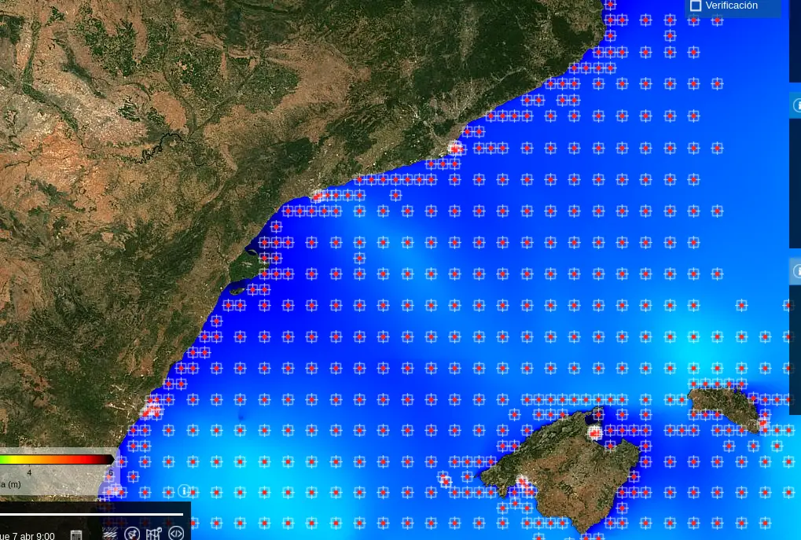

# Como determinar la meteorologia para bucear

## Introducción

Cualquiera de nosotros, siempre que estemos planeando un buceo, nos preocupa cual sera el estado de la mar para el instante de la inmersion. Nuestro hobby favorito se desarrolla al aire libre y **dentro** del medio marino, y eso hace que dependamos en un grado enorme de la meteorologia para poder efectuar nuestra inmersion con exito.

En mi opinion, no sirve de nada hacer una planificacion compleja de buceo  y luego desatender una correcta interpretacion del tiempo esperado para ese dia. Esta meteo puede hacer que la inmersion se tenga que aplazar y es importante saberlo con la mayor seguridad posible.

Por supuesto casi todos tenemos una u otra manera de ver el estado de la mar para nuestros buceos, por mi interes sobre la materia siempre he preguntado, y en casi la totalidad de los casos, he visto que se consulta aplicaciones del movil de meteorologia. Estas apps tienen datos sobre el oleaje, sobre el viento, etc son muy comodas, gratuitas y estan siempre disponibles, pero en este post voy a centrarme en esas otras fuentes, un poco mas ocultas y no por ello menos utiles, que nos ayudaran mucho en la tarea.

Me voy a centrar en datos que no he visto usar a nadie y que puedo aportar a la comunidad de buceadores, y al final del post hablare de las apps convencionales y alguna mejora oculta que podemos utilizar para poder interpretar y hacer un pronostico mejorado. 

## Factores meteorologicos a tener en cuenta

Para hacer una correcta planificacion, deberiamos tener un pc delante y fijarnos en varios factores del tiempo que atañen al buceo, aqui estan enumerados, en todas ellas necesitamos saber el punto geografico de la inmersion y la fecha , puesto que tenemos que consultar la prediccion para ese lugar y tiempo especifico.

### Altura significativa de ola
En mi opinion para mi la variable definitiva que determinara la viabilidad de la inmersion y que requiere la maxima precision posible de la prediccion en el punto. Para ello, en la peninsula iberica, utilizo el modelo meteorologico generado por [Puertos del Estado](https://www.puertos.es/es-es/oceanografia/AccesoSimplificado). Este modelo se vale de las predicciones de viento de HARMONIE de AEMET y de HRES-ECMWF para los siguientes horizones pasadas las 48h. Ademas aporta datos de observaciones de varias boyas instaladas en las cercanias de los puertos que hacen que el modelo mejore bastante en esos puntos.

Por ejemplo si quisieramos informarnos sobre que ola tendremos en el pecio Dragonera, que esta en el puerto de tarragona, podriamos ver el modelo y su calidad prediciendo en ese punto. 

Para el pecio dragonera tenemos muchas suerte porque es un punto del que disponemos observaciones gracias a una boya que registra con granularidad horaria el dato de altura de ola. Hay varios puntos mas, siempre boyas que ayudan a la prediccion de oleaje _en los puertos_ ya que aún nos importan mas las olas en el mundo portuario que buceistico.

Esto no quiere decir que debamos interpolar nosotros la prediccion a mano en el punto que nos interese, el propio modelo nos proporciona una prediccion en toda la rejilla de puntos del modelo. Asi que podemos consultar la prediccion de nuestro punto.

Si consultamos un punto podemos ver los datos en formato tabla de todas las variables del modelo, no solo de la altura significativa, tambien podremos ver el periodo y la direccion de la ola, la componente de mar de fondo o de viento que tiene la ola etc. Tambien viene datos del viento en ese punto que siempre puede estar bien para hacerse una idea de los vientos locales y el estado de la mar por más una via de experiencia del observador.

Ademas en [copernicus](https://myocean.marine.copernicus.eu/data?view=dataset&dataset=MEDSEA_ANALYSISFORECAST_WAV_006_017) disponemos de este modelo WAN sin ser mejorado por HARMONIE de Aemet.

### Temperatura del agua

Esta variable nos afecta mucho en el buceo, pero realemente como tal , no se predice puesto que es bastante facil deducir la temperatura a partir de la fecha del año y anteriores observaciones para esa misma fecha en el pasado.

En [Copernicus](https://myocean.marine.copernicus.eu/light) podemos consultar la prediccion de temperatura en nuestro punto del oceano asi como un historico del modelo analizado.

Aqui quiero aportar otra fuente que es bastante util para los viajes de buceo, donde queremos saber la temperatura en un punto del planeta ajeno a nuestra experiencia y latitudes, y queremos saber que abrigo llevarnos. En [WMO](https://climexp.knmi.nl/monthly_overview_world_weather/index.cgi?var=sst_ncep_w&mon1=jan&year1=2021&anomalie=nee&kort=nee&expert=nee&type=kaartwereld) podemos explorar la temperatura media de un mes en cualquier punto del planeta, no es preciso, pero nos puede ayudar a planificar un viaje sabiendo la fecha y el destino.

Tambien la nasa tiene otra mision llamada [MUR](https://podaac.jpl.nasa.gov/dataset/MUR-JPL-L4-GLOB-v4.1) que mide la temperatura marina a escala global, se puede visualizar con la herramienta de la nasa [worldview](https://soto.podaac.earthdatacloud.nasa.gov/?v=-18.78720059082591,30.727507641081075,21.28282587652165,50.51208320933394)

### Corriente

Esta variable nos afecta tambien en el buceo, y que buceador no habra soñado con saber que dia no habra corriente en ese pecio tan increible? pero esa variable la he estudiado menos a dia de hoy. Veo que existe un dato de velocidad del agua en el plano horizontal pero no entiendo aun que niveles verticales se usan para medir y/o predecir.

En [copernicus](https://myocean.marine.copernicus.eu/data?view=dataset&dataset=MEDSEA_ANALYSISFORECAST_PHY_006_013) podemos ver los datos de corriente en varios datasets, es la variable que esta disponible en windy tambien, no he podido nunca repetir tantas veces una inmersion como para contrastar como buceador si es util, pero estaria genial poder hacerlo.

### LLuvia y viento
Aunque conviene mirar tambien estas variables, yo al menos las considero menos importantes aunque pueden derivar en otras como la **visibilidad** que sí nos interesan, haciendo un estudio de los dias pasados sobre lluvia y temporales podemos deducir una mala o buena visibilidad por ejemplo.

Tambien podemos planear si vamos en velero, o si el porteo del equipo nos obliga a andar bajo la lluvia o cualquier otro motivo mas extravagante y nos puedan afectar estas variables, en todo caso para ellas remito al punto siguiente sobre las apps convencionales.

## La via convencional

Para consultar la meteo en un punto, usaremos la aplicacion  [windy](https://windy.com), habia varias mas, pero ya se esta poniendo bastante de moda entre cualquiera esta aplicacion que es la que reune mayor numero de capas, modelos y datos.

Recomiendo para una planificacion seria, usar el pc en lugar del movil a ser posible, ahi podemos valernos de toda la interfaz de la aplicacion. En ella podemos ver la informacion de todas las variables anteriormente descritas, pagamos un poco de precision en el punto pero ganamos poder tener una prediccion en cualquier punto del planeta, no solo en la peninsula iberica.

Ademas de consultar el oleaje aqui, podemos consultar mas el "como estara el dia" en general, (temperatura, lluvia y viento) y para ello en lugar de abrir la app y ver la prediccion primera que nos proporciona, recomiendo hacer una vista **multimodelo** de estas variables, aqui indico cómo:

 

Esto nos ayudara si vemos consenso en la prediccion o si vemos discrepancia entre modelos. No deja de ser lo mismo , una consulta de como va a ir el tiempo, pero viendolo a traves de 4 o 5 fuentes que siempre nos puede dar una mayor vision del grado de incertidumbre que manejan los modelos para ese punto en el tiempo especifico.

