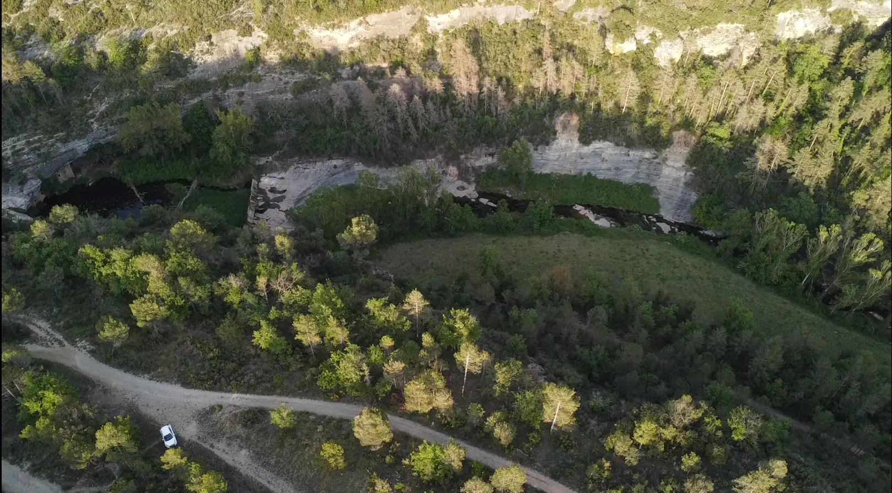
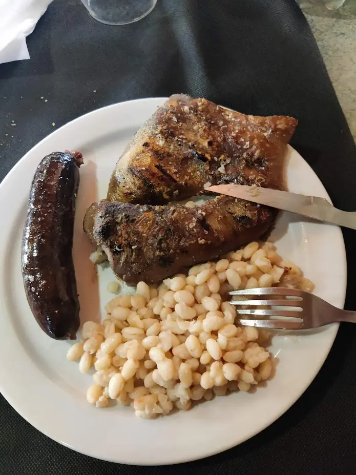
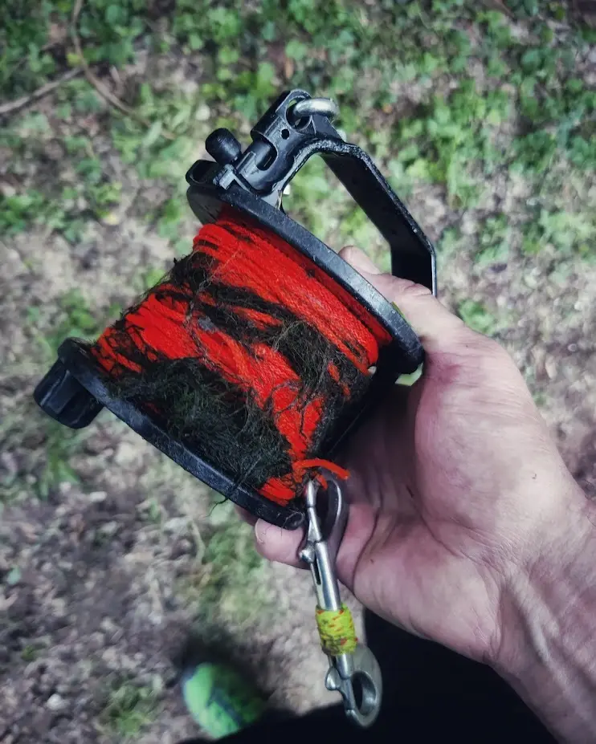

Este artículo no trata ni de buceo en el mar ni de exploración de cuevas, sino más bien de la investigación de pecios o construcciones humanas sumergidas. Juan Farrerons me escribió el otro día sobre este molino que encontró en internet. Él comparte mi pasión por la exploración y también busca lugares en los que podamos adentrarnos. Aquí está el proyecto de esta inmersión.

## Dia de investigación

El primer día, decidí acercarme solo por la tarde, después de trabajar, con el objetivo de investigar si era posible acceder al lugar, especialmente considerando las dificultades potenciales del acceso. Equipado con el dron, emprendí el viaje en coche, utilizando Google Maps para orientarme hasta el punto de interés, ya que aparecía en la aplicación.

El trayecto comenzó con una carretera que me llevó hasta Moià. Desde allí, continué por un camino de tierra muy deteriorado que tomaba entre 20 y 25 minutos recorrer. Este tramo fue especialmente desafiante para mi coche urbano, ya que el camino estaba en muy mal estado. A pesar de las dificultades, logré llegar al destino.

Al llegar, me encontré con un entorno natural impresionante, lo que me motivó a desplegar el dron. Mi intención era doble: por un lado, quería capturar algunas imágenes del lugar, y por otro, necesitaba investigar el acceso exacto hasta el agua. Volar el dron me permitió tener una vista aérea detallada y evaluar mejor las condiciones del terreno.

Durante el vuelo del dron, pude confirmar que el acceso al agua era técnicamente posible. Sin embargo, algo llamó mi atención de inmediato: el agua estaba negra. No pude determinar la causa exacta, pero sospecho que podría deberse al lodo que se acumula en la zona. Esta observación me hizo reconsiderar la viabilidad del buceo. A pesar de la accesibilidad, la condición del agua indicaba que bucear sería muy difícil, si no imposible, debido a la falta de visibilidad y las posibles complicaciones que el lodo pudiera causar.

## Dia de buceo

El día de buceo comenzó con un delicioso "esmorçar de forquilla" en Moià, un desayuno tradicional que nos dejó con el estómago lleno y listos para la jornada. Con energías renovadas, nos dirigimos al mismo punto que había visitado el primer día. Ya conscientes de que el buceo sería prácticamente imposible debido a la baja visibilidad del agua, cambiamos nuestro enfoque. Decidimos centrarnos en grabar una gran cantidad de contenido para crear un video atractivo, documentando la experiencia desde todos los ángulos posibles.

Para llevar a cabo esta tarea, trajimos todo nuestro arsenal de grabación. Esto incluía drones, cámaras 360, varias GoPros y equipos para timelapses. Desde el momento en que salimos del coche, comenzamos a grabar cada paso del proceso. Documentamos la preparación del equipo, el camino hacia el agua y todos los pequeños detalles que hacían única la experiencia. Cada miembro del equipo tenía una tarea específica para asegurarnos de no perdernos ningún momento crucial.

Al llegar al agua, la mala visibilidad que había observado el primer día se confirmó. Aun así, nos sumergimos e intentamos hacer dos o tres inmersiones cortas para comprobar si había alguna construcción sumergida. Sin embargo, la visibilidad era tan escasa que no pudimos identificar ninguna estructura bajo el agua. Tras unos diez minutos de intentos fallidos, decidimos salir del agua.

De vuelta en tierra, seguimos grabando. Capturamos el proceso de desmontaje y recogida del equipo, así como nuestras reflexiones sobre la experiencia. Aunque no pudimos bucear como habíamos planeado, la jornada fue productiva en términos de contenido. Conseguimos muchas tomas interesantes que esperamos poder editar en un video atractivo, mostrando tanto los desafíos como la belleza del entorno. Con todo el material recogido, nos sentimos satisfechos por haber aprovechado al máximo el día, a pesar de las dificultades encontradas.

## Dia de edición de video

Con todo el material de video de la mañana, dediqué la tarde a editarlo. Revisé las tomas, seleccioné las mejores y las organicé en una secuencia coherente. Utilicé imágenes del dron, cámaras 360 y GoPros para ofrecer diversas perspectivas.

Añadí transiciones suaves, corregí el color e incorporé música de fondo. También incluí subtítulos y descripciones breves para dar contexto. Después de varias horas de trabajo, terminé el video. Aquí está el resultado.


