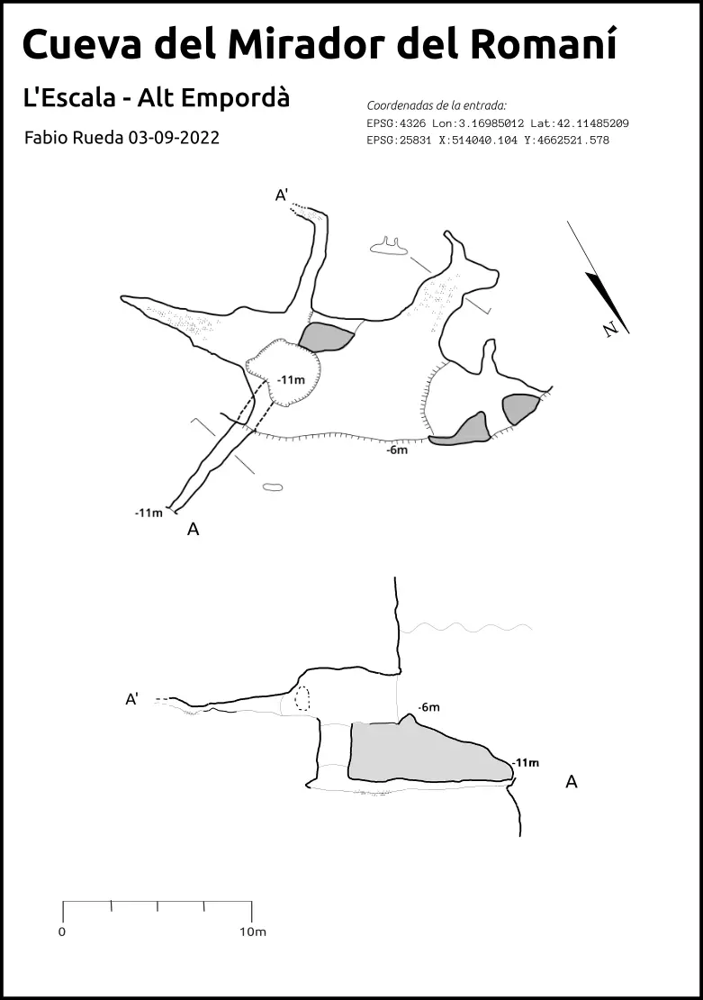

# La exploracion de la Cueva del mirador

Esta cueva está en la costa de l'Escala, en la pared que hay entre Illa Mateua y Cala Montgo, cerca de una punta llamada El Romaní, y hablando mas en terminos toponimicos de buceo, entre los puntos de "La Depuradora" y "La Xinxa".

## Entorno
He hecho varias inmersiones a esta cueva, esta justo despues de la pared que hay al pasar el tunel de la depuradora. Justo antes de la cavidad, hay un tunel recto que une el mar abierto con el cañon que queda a la derecha y cuya topografia hizo Josep Guarro hace unos años.

La pared gira a la derecha y el ambiente se oscurece mucho, estamos justo en el area del psicoblock, donde en verano se escala y ponen una linea para hacer equilibrios. En el vertice de la parabola que hace la pared aqui, esta justo la cueva a unos 5 o 6 metros de profundidad.

## Plan de trabajo
Mi plan es ir haciendo inmersiones e ir haciendo la poligonal cada vez mas grande, uniendo todas las cuevas con hilo por fuera a mar abierto. Este sistema no desarrolla hacia dentro de la piedra, pero es bastante amplio a lo ancho, sobre los 70-100m de poligonal en total.

## La restriccion
Esta cueva tiene como interes principal un pozo de unos 5 metros de profundidad que acaba en una galeria estrecha que vuelve al mar por una restriccion, ultimamente la estan haciendo mas buceadores cosa que me llena de orgullo.

## Topografia 
En esta topografia he aprendido a elegir siempre el perfil (extended elevation) de la topo segun el corte que sea mas representativo, en un principio quise hacer el acorde a la planta, pero he decidido elegir otro donde se vea la pared y la linea de costa de manera perpendicular, logrando que se entienda mucho mejor.  

### Dibujos y bocetos
He encontrado bocetos a lapiz y la poligonal , la dejo aqui aunque no tenga interes.

