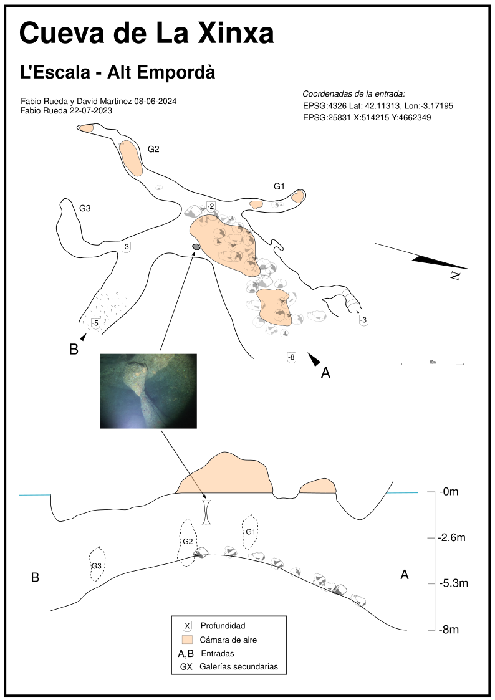

# La exploracion de la Cova de La Xinxa

Esta cueva está en la costa de l'Escala, en la pared que hay entre Illa Mateua y Cala Montgo, entre la depuradora y la punta de trencabrasos,es una zona de inmersion recreativa puesto que la cavidad es facilmente buceable, siempre se ve el azul y alberga un gran volumen de agua para moverse dentro sin problemas.

## Plan de trabajo

Igual que en las otras cuevas que he topografiado en la zona, el trabajo es el mismo, consiste en viajar desde illa mateua en scooter hasta el punto, pasando por la depuradora y la pared hasta la zona de la xinxa. Intento meterme por las galerias mas significativas y depsues de verla entera, hago otra inmersion con el carrete, y mi sistema de topografiar.

## Descripcion de la cueva

Segun se llega con el scooter desde la depuradora, hay que tener paciencia y continuar rumbo Sur pegado a la pared hasta que se llega a la entrada. Se puede ver la entrada enorme y oscura que invita a entrar, una vez dentro a los pocos aleteos veros el azul de nuevo por la otra salida, arriba en el techo veremos un par de burbujas , y a la izquierda una columna bastante grande donde se puede entrar entre ella y la pared.

Hay 3 galerias secundarias en la pared derecha, pero no miden mas de 20m cada una de ellas, se puede entrar con seguridad puesto que no hay sedimento y al final de ellas hay burbujas, con algun espeleotema pequeñito.

## Exploracion

El proceso es el habitual, solo queda explicar que en la Galeria 2, hay una piscina donde hay que pasar casi por encima del agua desde la burbuja y avanza a otra borbuja aun mas estrecha donde ya no saque la cabeza pero se veia la roca desde dentro del agua asi que dudo que tenga continuación

## Topografia

