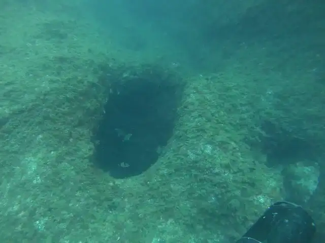
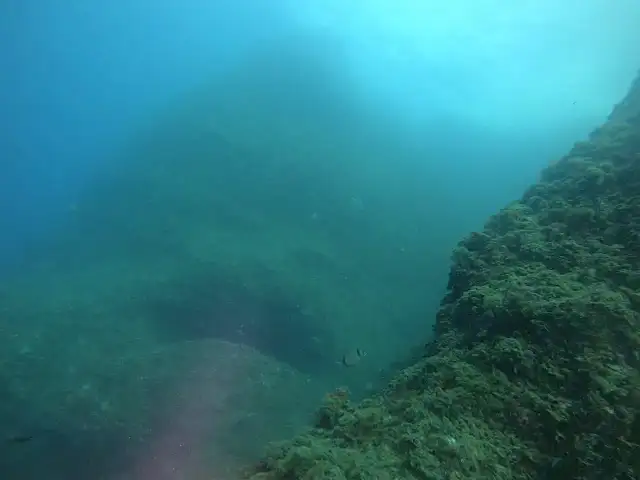
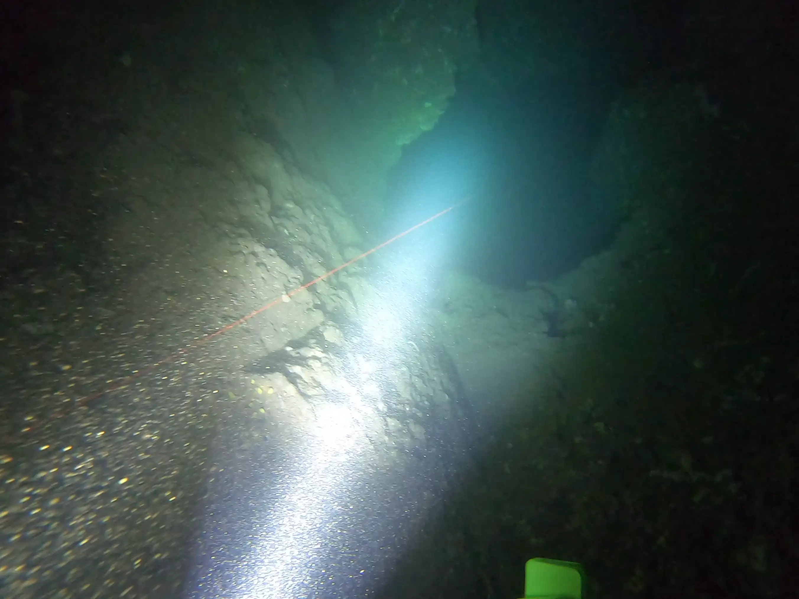
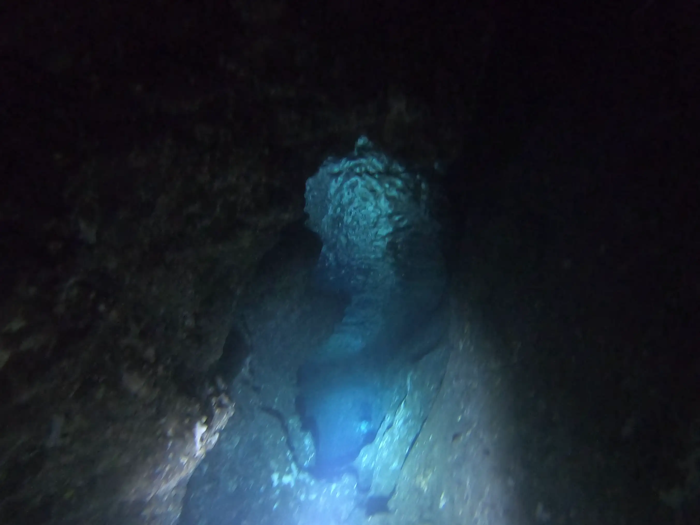
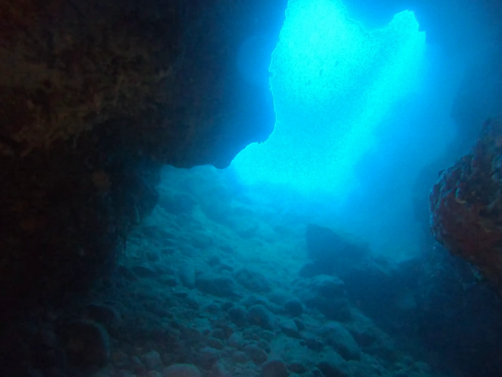
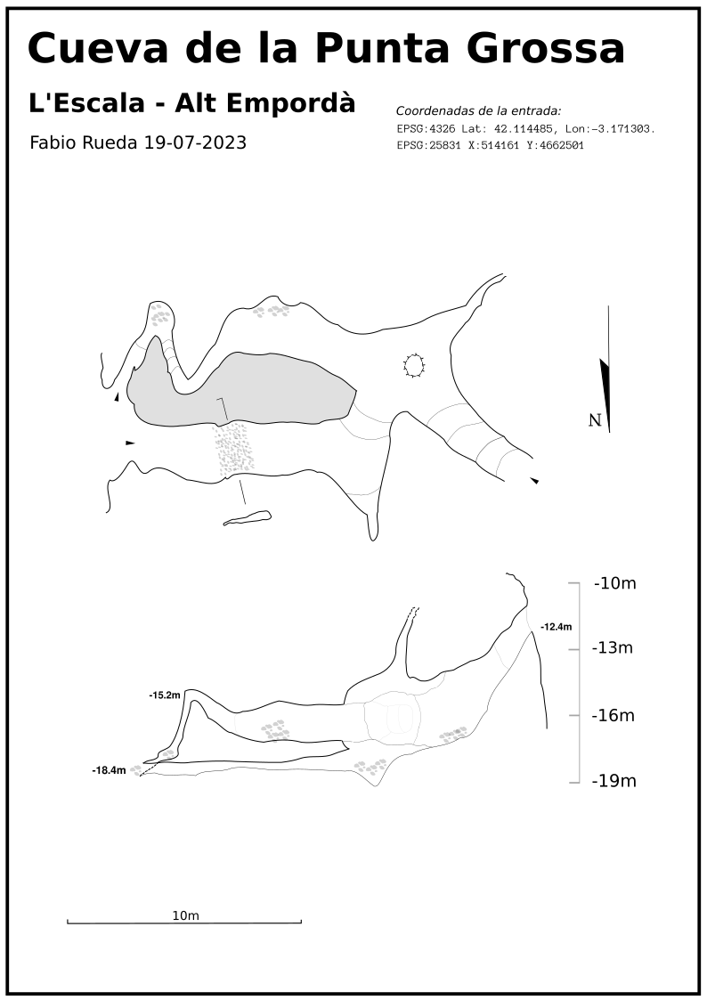

# La exploracion de la Cova de Punta Grossa

Esta cueva está en la costa de l'Escala, en la pared que hay entre Illa Mateua y Cala Montgo, entre la depuradora y la punta de trencabrasos, se puede ver un agujero redondo en medio de una roca grande, y tiene otra entrada a -19m con las rocas mas rotas y escarpadas.

## Plan de trabajo

Igual que en las otras cuevas que he topografiado en la zona, el trabajo es el mismo, consiste en viajar desde illa mateua en scooter hasta el punto, pasando por la depuradora y la pared hasta  punta grossa. Intento meterme por las galerias mas significativas y depsues de verla entera, hago otra inmersion con el carrete, y mi sistema de topografiar.

## Descripcion de la cueva

Segun se llega con el scooter desde la depuradora, se puede ver un agujero redondo en medio de la pared a 12m de pronfundidad, una vez en el agujero, se ve rapidamente que la cueva tiene desarrollo, se baja por el tunel y pronto se ve la sala principal, en ella sale un ramal hacia la izquiera, que se convierte en una galeria estrecha y plana con canto rodado en el fondo y una vez pasada la restriccion se llega a la otra salida de la cueva. Si en lugar de ese ramal se sigue hacia dentro, la galeria se va estrechando y se hace un pequeño tunel que sube y baja , que esta lleno de langostas. Una vez hecho la espiral estrecha, se llega a una pequeña sala pequeña donde se puede girar y salir entre rocas a la salida profunda.

## Exploracion

He entrado primero a instalar el hilo, una vez instalado correctamente, he vuelto a medirlo y topografiar todo , a la vez que grabando segun lo recorria, y una tercera pasada para recogerlo todo y grabar en senido contrario.

## Fotos relevantes

## Topografia

