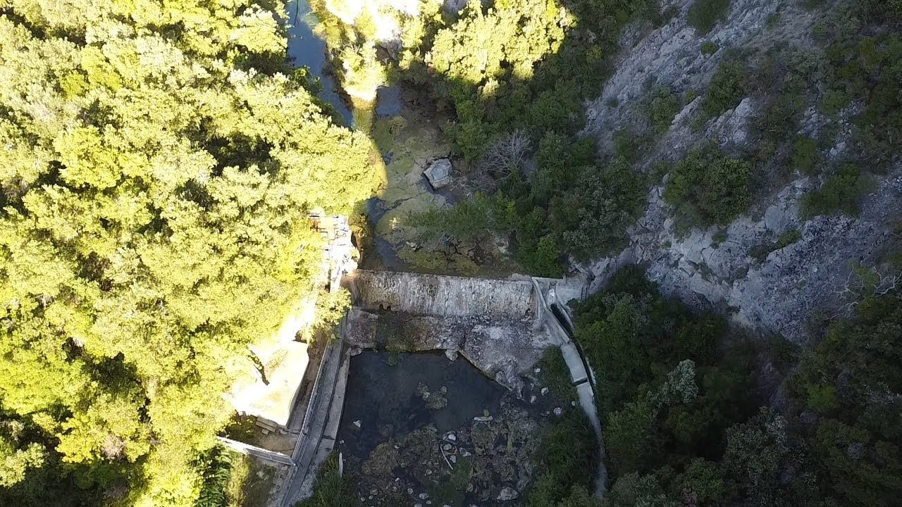
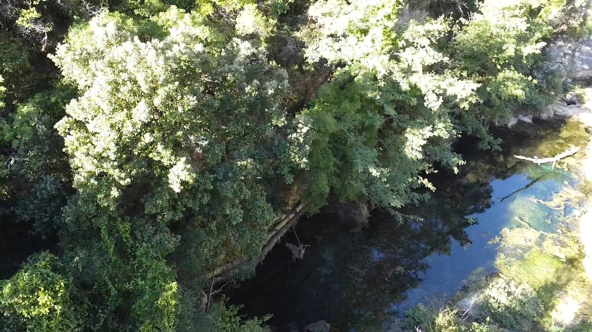
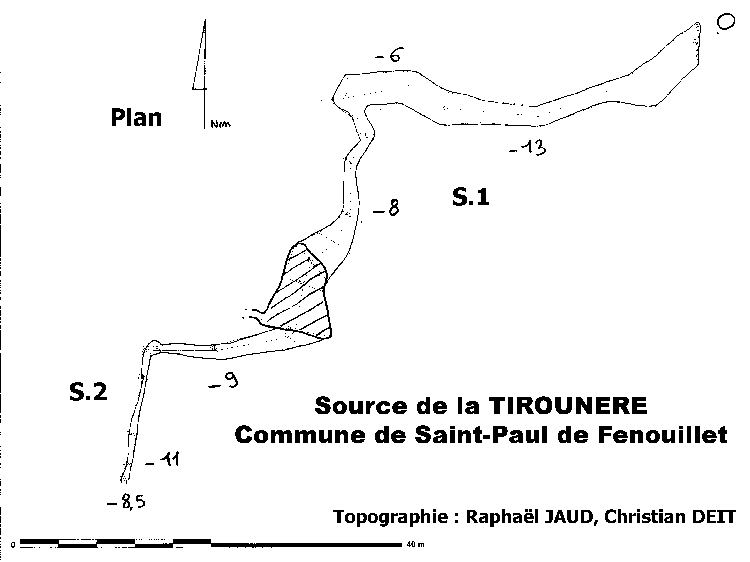
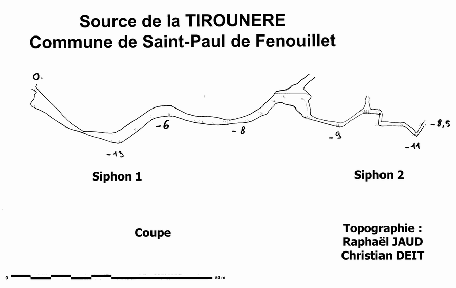

# La topographie de la Source de la Tirounére

J'ai découvert cette grotte un jour en revenant de Lot, totalement accro à la spéléologie sous-marine et en explorant d'autres cavités sur Internet, j'ai trouvé celle-ci que j'ai notée sur la carte, car elle se trouve à 1 heure d'Estramar et plus ou moins près de Barcelone. Il n'y avait pas beaucoup d'informations, mais cela semblait suffisant pour le "si un jour..."

Le jour est arrivé. Un jour, je suis allé avec Marc Pintor et Delfi Roda à Font Estramar et la gendarmerie est intervenue et nous a rappelé que l'accès était interdit. Après cette déception, je leur ai parlé de cette grotte dont je n'avais aucune idée mais qui était proche, et par chance, ils la connaissaient déjà ! Alors nous y sommes allés et nous l'avons explorée, une plongée courte mais juste assez pour la découvrir et tomber amoureux de l'endroit.

## Environnement

La grotte est située dans le village de Saint-Paul-de-Fenouillet, dans les Pyrénées-Orientales en France. Le village a pour attraction touristique les Gorges de Galamus, une gorge magnifique créée par la rivière Agly, un peu plus bas dans cette gorge en suivant le cours d'eau, se trouve la grotte, à côté d'un barrage sur la rivière, dont l'entrée se trouve sur la rive gauche en remontant le fleuve.

Voici quelques photos de la rivière et du chemin depuis la voiture.

### Logistique

La voiture est laissée là où la route se termine et il y a une barrière, donc tout l'équipement doit être pris et transporté jusqu'au barrage de la rivière. Dans mon cas, comme il était sec car l'eau ne le franchissait pas, nous avons pu laisser les bouteilles en passant toujours par la rive gauche de la rivière ; du côté droit, il y a des escaliers pour monter jusqu'à la rivière plus confortablement.

On monte les bouteilles et l'équipement jusqu'à l'eau, puis on retourne à la voiture pour enfin revenir avec la combinaison directement dans l'eau.

## La grotte

Cette cavité commence dans la rivière Agly et après une zone de cailloux se trouve une restriction contre-courant en raison de l'étroitesse et des cailloux très lâches qui donnent l'impression que l'entrée est dangereuse. Après un passage entre des grosses pierres lâches, on arrive à une bulle où l'on peut voir la main de l'homme avec des tuyaux pour l'extraction de l'eau vers l'extérieur, c'est là que commence le siphon 2, avec une autre restriction et ensuite un passage étroit et avec des restrictions jusqu'à ce que le fil se termine.

## La plongée

La plongée est difficile, elle nécessite une bonne maîtrise technique, avec la combinaison sèche (ce n'est pas indispensable car la température, du moins en septembre, est de 16 ºC, et la plongée dure 30 min), la flottabilité est très difficile car on ne reste jamais à la même profondeur pendant plus de 20 secondes, il faut donc l'ajuster constamment et toujours à une profondeur maximale de -12m.

De plus, comme je l'ai déjà dit, l'entrée est délicate car quand on touche un caillou, 5 ou 6 glissent, et même si je ne peux pas garantir un éboulement, c'est certainement l'endroit où je serais le plus prudent en plongée.

La dernière partie a quelques restrictions très amusantes et stimulantes, où il me semble compliqué de pouvoir passer avec une bouteille de 12L, bien que les spéléologues à la française le fassent sans problème et cela peut être vu sur YouTube. Avec le sidemount classique 2x12L, aucun problème.

## L'ancienne topographie

Il existe une topographie avec un plan et un profil

Après l'avoir plongée et avoir beaucoup étudié la topographie, la zone du début du S2 et de la zone aérienne n'était pas tout à fait claire pour moi, alors j'ai décidé de la topographier à nouveau.

## La nouvelle topographie

Après deux plongées avec l'aide de mes camarades Lluis Vila et Joan Farrerons, j'ai réussi à faire la polygénie et à avoir une vidéo détaillée de toute la grotte pour pouvoir dessiner les parois. Et voyant que ce qui est le plus remarquable dans la grotte, ce sont ses restrictions, j'ai décidé de mettre des photos pour mieux les comprendre.

Je la laisse au format [pdf](https://buceo.avances123.es/es/p/source-de-la-tiroun%C3%A8re/topografia.pdf) au cas où quelqu'un préfère voir avec un zoom plus important.

Les données de la polygénie sont disponibles sur [github](https://github.com/avances123/topografias/blob/master/tirounere/cova.th)

### Données en 3D

## Vidéo complète de la grotte



## Conclusion

Si vous cherchez une grotte avec une pénétration de moins de 120m, étroite et tortueuse dans un cadre magnifique et une rivière incroyable, cette grotte va vous plaire. J'espère avec ce post, la rendre un peu plus célèbre pour mes camarades espagnols et les encour
