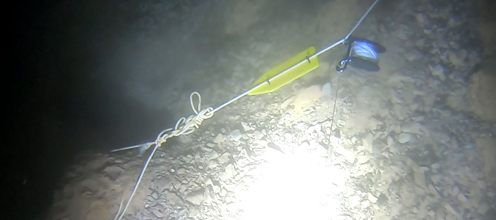
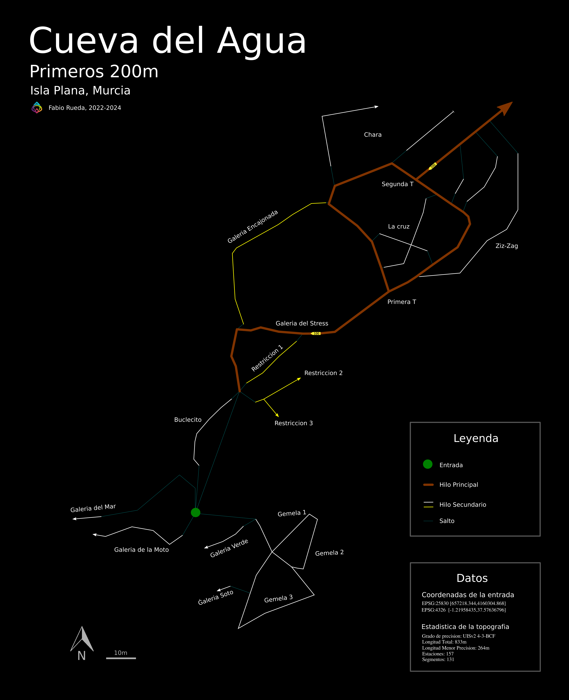
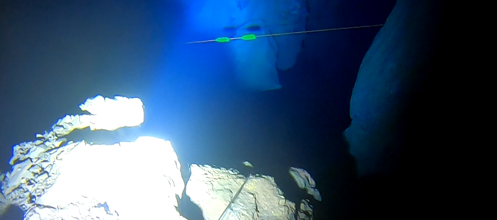
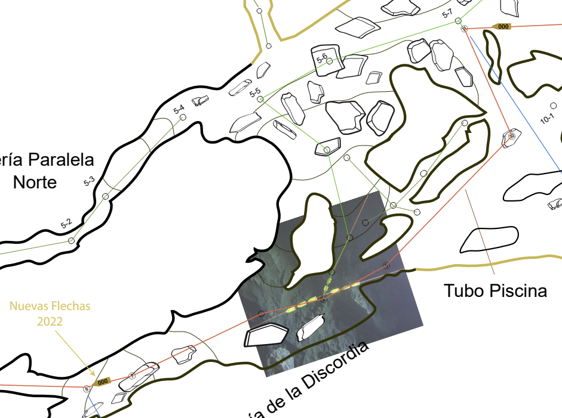
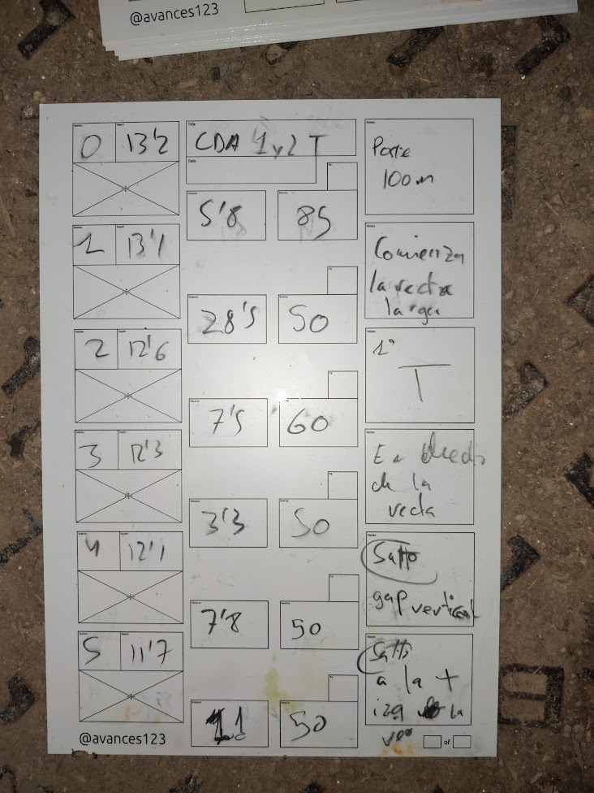
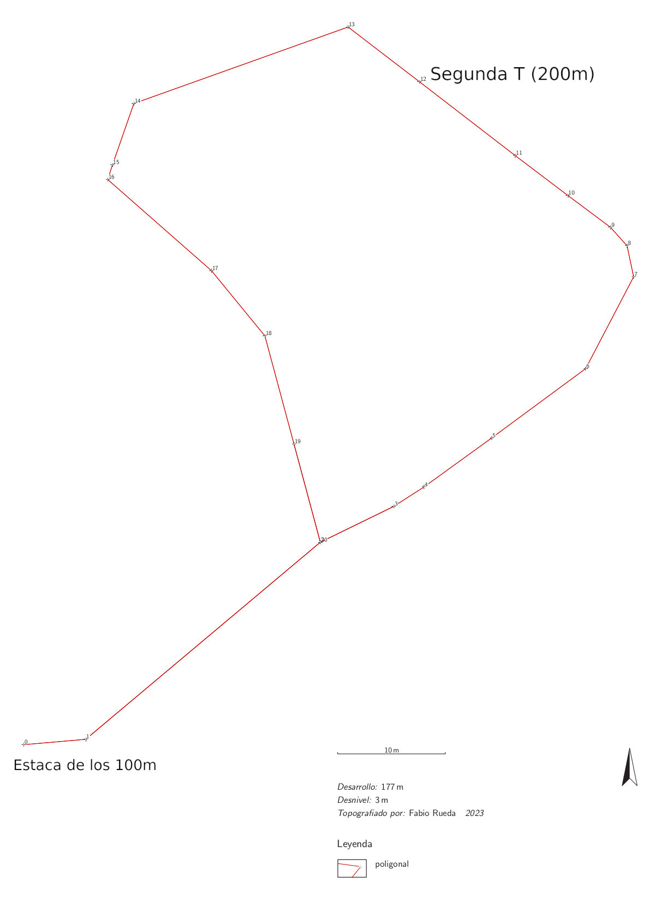
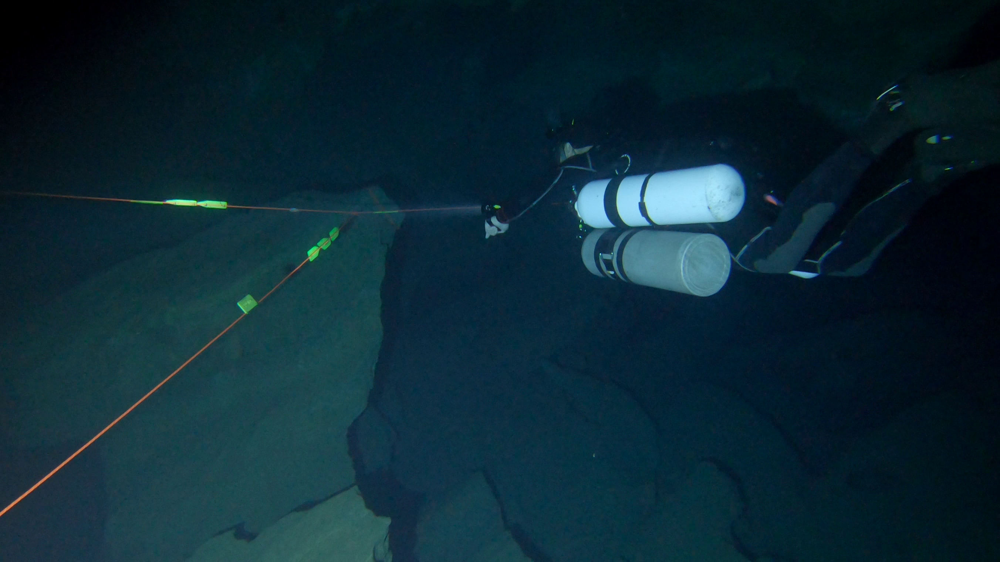

## Introduccion
En mis anteriores escritos, he mencionado mi hábito de llevar a cabo el mapeo de las galerías cuando visito la Cueva del Agua en Murcia. Mi objetivo es explorar áreas cada vez más desafiantes para continuar con la mejora del proceso. En mi última expedición, mi intención era adentrarme en el laberinto de 600 metros, que destaca por ser la sección con mayor cantidad de lagunas topográficas en toda la extensión de la cueva, justo antes del tramo de 850 metros. Sin embargo, me encontré con un inconveniente: mi vehículo, el scooter, está bastante antiguo y presenta problemas con la entrada de agua. Por lo tanto, mi enfoque cambió y decidí dedicarme a recorrer exhaustivamente todos los hilos instalados en la cueva, llevando a cabo el proceso de topografía. Desafortunadamente, debido a la percolación y a las condiciones generadas por mi propia presencia, el agua turbia obstaculizó mi visión, impidiéndome ver con claridad la plantilla utilizada para el mapeo.



## La topografia
La topografía original tiene un fondo negro para realzar los colores naturales de la cueva. Además, he creado una [versión alternativa](mapa_poly_negativo.png) con fondo blanco y colores complementarios para facilitar su impresión.




## Principales Caracteristicas del mapa

He procedido a realizar el trazado cartográfico del recorrido de la cueva en su estado al momento de la publicación de la topografía, indicando la fecha correspondiente. En el mapa, cada segmento de este recorrido está representado por un código de color que refleja la tonalidad presente en la cueva. El hilo principal, marcado en naranja y establecido meticulosamente por el grupo de exploración, ha sido dibujado con un trazo más grueso, mientras que los hilos secundarios se representan con trazos más delgados y de color blanco o amarillo, según su correspondencia cromática en la cueva. Los segmentos no instalados, identificados como saltos, están delineados con trazos más finos y en color azul para destacar su naturaleza de ruta potencial que no está físicamente presente, pero que resulta útil para planificar itinerarios dentro de la cueva y calcular los equipos necesarios, como spools y cookies.

El mapa también cuenta con marcas de referencia cada 100 metros y 200 metros, visibles para el buceador bajo el agua, representadas por una flecha direccional. Asimismo, se incluye un punto esquemático que indica la entrada, representada no por la charca, sino por la primera formación rocosa característica en forma de Y, que se encuentra a una profundidad aproximada de 6 a 7 metros al ingresar en la cueva.

Los segmentos delineados en azul de trazo fino, como mencioné anteriormente, corresponden a tramos topográficos de mi propia exploración que han sido desinstalados y solo tienen propósitos de señalización de saltos en el hilo.

La topografía ha sido llevada a cabo con una precisión de error de 0.1 metros tanto en longitud como en profundidad, y un margen de 5 grados en el rumbo de las mediciones, la longitud de hilo de tipo "salto" no entra en las estadisticas.

## Explicacion del proyecto
El propósito del proyecto radica en la confección de una topografía adaptada específicamente para la navegación subacuática, centrándose en los buceadores y excluyendo pormenores irrelevantes para esta práctica. Este modelo estará focalizado única y exclusivamente en la representación de la poligonal, aunque carezca de importancia en la topografía de cuevas terrestres, resulta crucial para el buceo, sirviendo como guía cardinal en el entorno de la cueva y siendo perceptible físicamente por los buceadores.



Hasta la fecha, se ha llevado a cabo la delineación de la poligonal principal y sus ramificaciones secundarias hasta una profundidad de 200 metros. No obstante, existen áreas pendientes de cartografiar, como la región más alejada de las galerías de la Chara y la clausura del circuito del mar. A pesar de la exploración más allá de estas secciones, la precisión de las mediciones realizadas no ha sido óptima (con un margen de error en el orden de los decímetros). Dichas mediciones menos precisas no serán divulgadas hasta alcanzar el mismo nivel de precisión que las restantes, considerando que las complejidades inherentes a las mediciones de las paredes y la constancia de las mediciones de profundidad resultan menos relevantes para la comunidad de buceo.

El desarrollo del proyecto continuará con la misma metodología, pero a un ritmo más acelerado, gracias a la completa automatización del trazado hasta el punto de referencia de 850. La decisión de presentar esta sección en la actualidad obedece a la creencia de su gran utilidad para estudiantes, instructores y turistas que realicen su inmersión inicial en la zona, brindándoles una visión clara del camino a seguir dentro de la cueva, sin adentrarse en detalles sobre las paredes o las profundidades, aspectos que, debido a su complejidad o constancia, resultan menos esenciales para los buceadores.

### Topografia actual
En el ámbito de la topografía actual, la abundancia de información histórica como dibujos, fotos e hilos antiguos puede crear confusión para los buceadores en la actualidad. Por ello, me propongo centrar nuestros esfuerzos en mapear únicamente los hilos instalados en la fecha actual, proporcionando una representación clara y precisa. Este enfoque permitirá a los buceadores contar con información actualizada para una navegación más segura y eficiente, manteniendo la integridad de los datos históricos para referencia y análisis.



### Integridad y Revision por pares de los datos recogidos

Los datos recopilados han sido procesados utilizando software especializado en topografía, lo que ha permitido minimizar la complejidad asociada con la gestión de cierres de bucles y el almacenamiento sistemático de la información adquirida. Además, se ha habilitado un mecanismo de revisión abierta para fomentar la transparencia y la corrección de posibles errores. Este enfoque se ha implementado a través de una plataforma colaborativa [(Datos Online)](https://github.com/avances123/topografias/blob/master/cda/las_T/cova.th), donde cualquier individuo tiene la oportunidad de contrastar los datos y, en caso necesario, sugerir correcciones mediante un 'pull request'. Dado que estos datos están disponibles en un formato de código abierto, se facilita su acceso y utilización por parte de cualquier interesado en la materia.




### Estadisticas globales de toda la cueva
En esta presentación se ofrece un resumen estadístico integral del tramo de hilo correspondiente a la Cueva del Agua hasta una profundidad de 200 metros. Cada fila de datos engloba una encuesta topográfica referente, habitualmente asociada a una galería o segmento relevante. Cabe mencionar que las estaciones y segmentos clasificados como saltos no se consideran en esta estadística, lo cual se refleja en múltiples filas que contienen mediciones puras de las dimensiones de la caverna, excluyendo tales elementos de análisis.

```
Title                 Length  Depth     Explored  Approx.  Duplicate  Surface  Shots  Stations
Cueva_del_Agua        833     13        0         264      0          0        131    157
Las_Gemelas           164     11        0         0        0          0        21     27
gemelas1              68      8         0         0        0          0        9      10
gemelas2              13      4         0         0        0          0        1      2
gemelas3              31      6         0         0        0          0        3      4
galeria_soto          5       1         0         0        0          0        2      3
galeria_verde         17      5         0         0        0          0        4      5
union_gemelas         30      4         0         0        0          0        2      3
De_0_a_100            109     4         0         0        0          0        19     22
primeros_metros       46      2         0         0        0          0        7      8
stress                27      4         0         0        0          0        6      7
encajonada            37      1         0         0        0          0        6      7
Caverna               128     11        0         10       0          0        41     50
hilo_caverna          0       0.000000  0         0        0          0        7      8
caverna_gemelas       0       0.000000  0         0        0          0        2      3
buclecito             30      3         0         0        0          0        9      10
caverna_mar           10      0         0         10       0          0        5      6
moto                  37      8         0         0        0          0        6      7
a_gemelas2            0       0.000000  0         0        0          0        3      4
restricciones_cartel  52      4         0         0        0          0        9      12
restriccion1          26      2         0         0        0          0        5      6
restriccion2          18      2         0         0        0          0        3      4
restriccion3          8       0         0         0        0          0        1      2
De_100_a_200          431     5         0         254      0          0        50     58
bucle                 177     5         0         0        0          0        20     21
la_cruz               63      1         0         63       0          0        10     12
eje1                  36      1         0         36       0          0        6      7
eje2                  27      0         0         27       0          0        4      5
zig_zag1              76      0         0         76       0          0        7      8
ventana_larga         31      0         0         31       0          0        5      6
ventana_corta         17      0         0         17       0          0        3      4
chara1                22      0         0         22       0          0        2      3
chara2                45      0         0         45       0          0        3      4
```


## Futuras Mejoras
El propósito es conservar la simplicidad del diseño, pero se considera la incorporación de símbolos para representar restricciones, pozos o chimeneas de gran importancia en el mapa.

Se establecerá una sección dedicada exclusivamente a los artículos relevantes para asegurar la disponibilidad permanente de la topografía más actualizada y completa.

Además, se llevará a cabo la georreferenciación sobre la ortofoto de superficie y se generará un modelo tridimensional para ofrecer una representación espacial más completa y precisa.


