# La exploracion de la Cova dels Arquets

En esta entrada explico desde el principio la idea, planificacion y ejecucion de la exploracion de una cueva marina en la costa catalana, aqui cuento mis retos, ilusiones, errores y exitos por si puede servir de referencia a algun explorador que empieza como es mi caso. 

Esta cueva está en la costa de l'Estartit, mirando a las islas Medas, en la pared que se sitúa al Norte de la punta del molinet. Es una pequeña cueva marina a -10m pequeña pero muy divertida y bonita. 

## Planificacion

Sobre ella solo hay artículos en periódicos explicando un accidente que hubo hace años. No existe topografía más que la que han hecho los periodistas en este [reportaje](https://www.elperiodico.com/es/sociedad/rescate-cueva-arquets-estartit-guardia-civil-sh/index.html). 

Después de leerlo un par de veces con los ojos como platos, me pregunto si existira algo en google con el nombre "cova dels arquets", pero no existe nada, ni en facebook ni en nigun foro de buceo... Parece que desde el accidente no hay absolutamente nada de informacion de esa cueva. Entiendo que sin formacion de cuevas ningun buzo debe entrar en ella, pero es posible que los buzos de cuevas no hayan entrado ahi? demasiado pequeña? demasiado peligrosa? todo son dudas, asi que no veo otro objetivo que al menos intentar bucear alli. 

Despues de buscar y tener clara la idea, entro en google maps para planear la logistica, el coche, el acceso al mar etc.El plan será dejar el equipo hasta donde permita el paseo marítimo, llevarlo al borde de la plazoleta y lanzarse al agua, nadar hacia el Norte y buscar la cuevecita. 

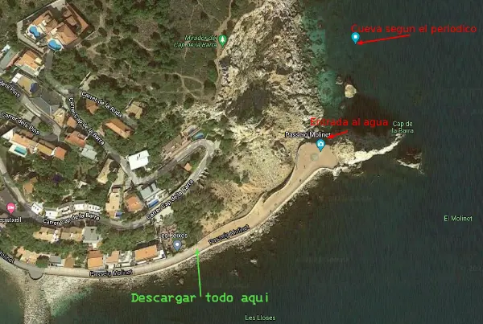

Como todo esta en duda, si no fuera posible entrar, no la encuentro, es inseguro o cualquier cosa, siempre puedo aprovechar para grabar en la cala, hacer ejercicios, probar equipo etc.  Siempre hay cosas positivas mientras estes flotando.

Me faltaba un compañero , pero por suerte en Cataluña para cualquier idea que tengo llamo a Joel Llebot y se apunta si tiene tiempo. Se lo comento y le parece una buena idea intentarlo. No seria la primera vez que vamos juntos a probar o descubrir alguna cosa.

## Dia 1

Es dia 19 de diciembre, salgo de Montgat directo a L'Estartit y me encuentro con la barrera libre, parece que me voy a ahorrar unos cuantos metros de porteo, asi que llevo el coche hasta la misma placeta del molinet. El pueblo está vacío completamente y hace mucho frío y niebla. El mar está como una tabla, Cuando el mar está así da incluso algo de respeto, ya lo dicen los marineros.

Esta calma es necesaria, puesto que tenemos que entrar por la parte derecha de esta foto, bajar por esas piedras el equipo y las botellas y entrar al agua desde ahí. Al final el porteo fue mas sencillo de lo que me esperaba.

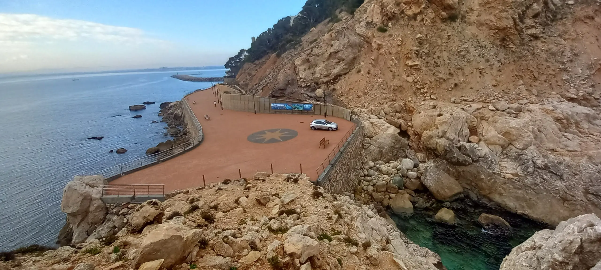

Mientras llegaba mi compañero Joel, preparé todo mi equipo en la plaza. Ademas de mis aletas de siempre, las rk3, me habia traido unas dive rite xt de mi compi Gonzalo para probarlas, son negativas y con el seco me apetecía probarlas asi que las transporte tambien hasta abajo para llevarlas y probarlas en el agua.

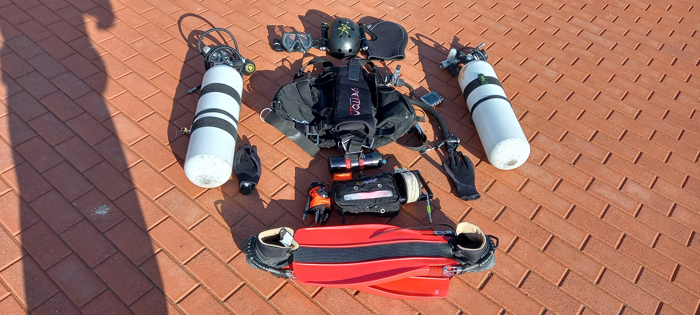

Una vez abajo nos equipamos y salimos nadando en superficie desde la lengua de agua a mar abierto y una vez cogido el aliento de nuevo y hecho el pre-dive check, nos sumergimos, el plan era sencillo, ir con la pared pegada a la izquierda viendo grietas y agujeros que pudieran indicarnos la entrada de la cueva.

Después de unos 5 minutos cerca del inicio, descubrimos un agujero donde se puede entrar, pero al ver que acaba justo 4m delante nos damos la vuelta, parecia prometedor y pensabamos que estabamos en la senda, pero la sorpresa aun nos estaba aguardando.

Seguimos nadando pegados a la pared con el fondo siempre a no mas de -6m, cuando en el periodico se leia que la entrada estaba a -10m, seguimos hacia delante cada vez con menos confianza, y menos gas, pero la cabezoneria de Joel de seguir y seguir, nos llevo al éxito.

Después de un par de salidas con la boya a superficie para situarnos, decidimos seguir hacia la siguiente calita pegados a la pared y justo al bajar y avanzar unos metros, pegado al fondo, como una ratonera en la pared, estaba el agujero de entrada, se veia claramente que ese agujero si era profundo, asi que tras celebrarlo, instalamos el nudo principal. Joel acababa de terminar su curso de Cave1 de GUE donde se entrena todo esto y qué mejor que fuera él el que lo anudara, asi de paso yo podría sacar la gopro y grabar.

Hacemos un breve cálculo del gas que teníamos a la entrada y nos adentramos, la cueva va subiendo en rampa llena de piedras redondas grandes donde cuesta hacer fraccionamientos, Joel sufre con las piedras porque se mueven todas, pero al ser recta no hacen falta tantos. Vamos subiendo con cuidado y con bastante alegría de por fin estar dentro de la cueva. Sobre los -4m gira 90 grados a la derecha, hacemos un fraccionamiento y giramos, en ese momento mire para atras y aun se veía una ventanita azul al fondo, que como en todas las cavernas, es de las imágenes más bonitas que se pueden ver.

Y después de rozarnos con piedras y techo un poco, sorpresa, la cueva cambia totalmente. Se llega a una sala muy grande de unos 4m de ancho , llena de lodo blanco en el fondo, parece que la restricción frena la fuerza del agua del mar y ya se convierte en una cueva mucho más tranquila con el agua como un cristal y donde cabemos los dos juntos, avanzamos un poco hacia delante y descubrimos un hilo a la derecha y dos aletas en el fondo, restos del accidente. 

Subimos a la burbuja sin quitarnos el regulador, estábamos bastante excitados y nerviosos por estar en el sitio que había pasado una desgracia, además rápidamente me di cuenta que el carrete lo habíamos dejado atado al hilo viejo de la cueva y no estaba en nuestras manos, asi que rapidamente bajamos de vuelta.

La vuelta se dio sin complicaciones , entendiendo un poco mejor la restricción viendola desde el retorno, y una vez fuera: euforia, y paseo de 20 minutos por la pared de vuelta , aunque se me hizo muy corto pensando en todo lo que había sucedido.

Viendo el perfil de la inmersion se puede ver en el incremento de la temperatura, el tiempo pasado en la cueva, y que el viaje, requiere de un scooter o un barco, equipo que en este momento lamentablemente no puedo disfrutar.

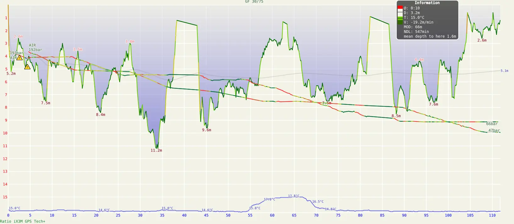

## Dia 2

En la segunda  inmersión ya no había adrenalina por la cueva, es segura y muy asequible, se puede bucear varias veces con dos botellas de aire, ya sabemos los puntos fuertes y débiles de este buceo, sabemos entrar y salir del agua e ir directos nadando por el mar hasta la entrada. La cueva seguia mas alla de la burbuja, nuestro objetivo seria seguir adelante, ojala siguiese muchos metros, sera lo primero que intentemos.

Ademas, para esta vez había estado estudiando como topografiarla, pues aunque todo el montgrí está plagado de agujeros, esta cueva es suficientemente relevante, tanto por longitud como por amplitud de la sala principal, como para que exista información espeleológica sobre ella. Yo nunca había topografiado ninguna y después de haber hablado en dos sesiones sobre el proyecto con Josep Guarro (mi mentor en este asunto, y qué mentor), me había convencido que era el proyecto ideal para mi, iniciarme en la topografía con una cueva donde poder completar el trabajo en una inmersión. En casa con toda la ilusion, me prepare una tablilla para introducir los datos de la topo.

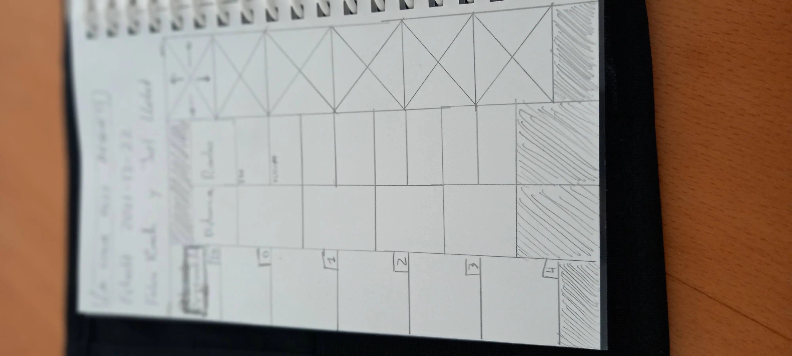

Con toda esta idea, preparé un carrete con nudos cada dos metros, un spool de 40m que no daría para toda la cueva pero servirá para topografiar por trozos. Mi idea fue tirar el hilo principal desde fuera hasta la punta de la cueva, y dejarlo así bien fraccionado como hilo de seguridad, puesto que había incertidumbre con el hilo de exploración que había preparado. No quería comprometer el hecho de tener un hilo disponible siempre, pero a posteriori parece mejor idea usar uno solo antes que tener dos hilos por la cueva, queda apuntado para futuros proyectos.

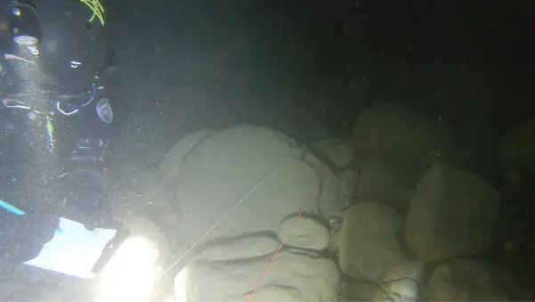

Nos equipamos y vamos directos a buen ritmo a -2m de profundidad por el mar hasta la cueva, y Joel se desquita de la instalacion del dia 1 fraccionando mucho menos y mas seguro, llegamos rapido a la burbuja y pasamos de largo directos a la zona desconocida de la cueva, donde quiza, nadie antes haya estado. La cueva cambia totalmente del lodazal, a piedras cortantes y afiladas propias de la pared de ese litoral, se nota que el agua aqui esta completamente calmada y no erosiona. 

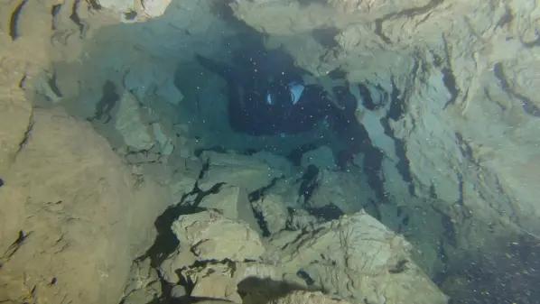

La galeria gira a la derecha y acaba pronto, para nuestra desilusion, despues comiendo, comentamos la fuerza que estabamos haciendo por que siguiera la cueva. Ahora creo que entiendo a otros exploradores experimentados que ya han sentido esta sensacion muchas veces, el "ojala tire esta galeria 300m". En la punta hay otra burbuja aire muy pequeña pero lo justo para poder sacar la cabeza y hacer una foto.

En esta parte de la cueva el agua esta a 18.5ºC , 4 grados centigrados mas caliente que en el exterior en el mar, estando a 14.5ºC. Ademas el dia 1 pude advertir una ligera haloclina en la entrada, quiza sea relevante este cambio de temperatura para posteriores investigaciones.

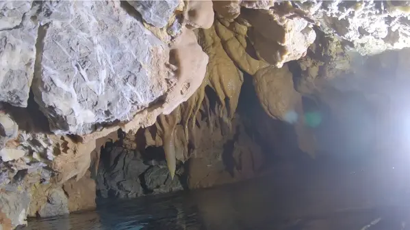

Mientras hacía esta foto , Joel estaba abajo delante intentando darse la vuelta puesto que no había hueco y la cueva se hacía impenetrable. Mi traje seco se engancho en una piedra y también me costó girar de vuelta, pensaba que se me perforaba. Por algunos momentos y con las piedras llenas de aristas llenas de barro por encima, me recordaba a la famosa cueva del agua, en Murcia.

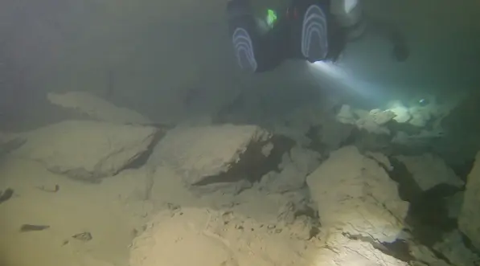

A la vuelta, se podia ver que la sala es bastante grande y tiene el agua transparente, pero es muy peligrosa porque todo el fondo es lodo que forma nubes muy facilmente

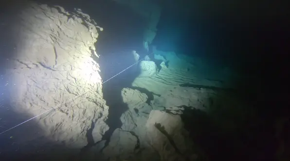

Decidimos sacar la cabeza en la burbuja, nos quitamos los reguladores con cuidado hasta ver que se podía respirar, y comentamos la jugada, la punta de la cueva, y los planes para topografiar en la segunda pasada.

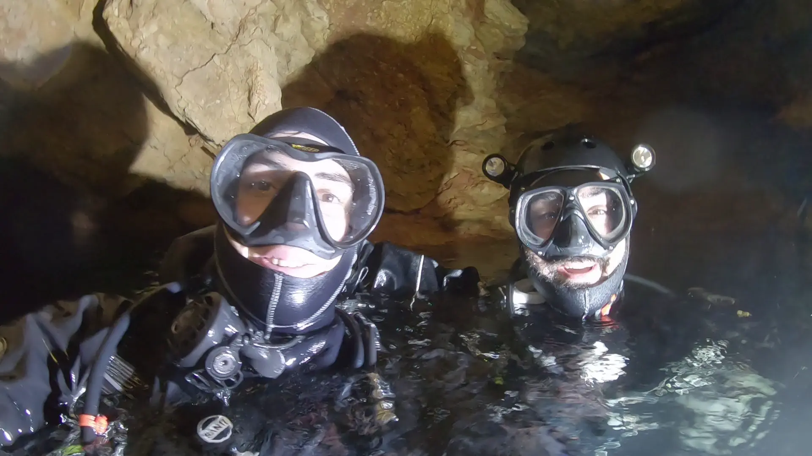

Llegando de vuelta a la restricción vi como el hilo, al rozar con el fondo, creaba bolas de lodo que enturbiaban el agua bastante, hay que ser fino en esta segunda parte de la cueva.

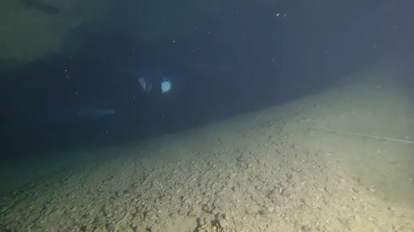

Una vez fuera en el mar de nuevo, el plan que tenia era el siguiente: Yo tiraria hilo naranja con nudos hasta el siguiente fraccionamiento, y volvería al anterior donde me esperaba Joel, que había tomado el rumbo de ese hilo, yo al volver contaría los nudos y anotaría la profundidad y distancia, el rumbo me lo comunicaba mi compañero y dejaba esa estación lista para iterar en la siguiente.

Asi lo hicimos 3 veces hasta que se acabo el hilo antes de la restriccion

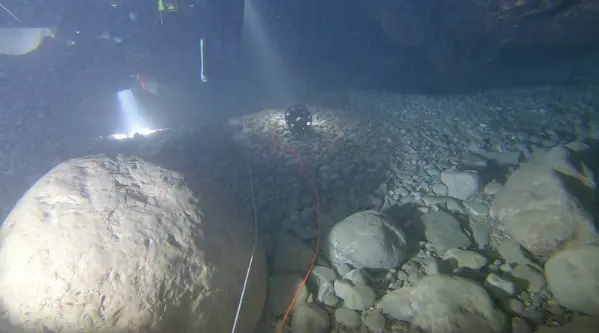

En ese punto apuntamos los datos y dejamos el hilo atado para proseguir con la topo hasta el final, puesto que de ese punto a la punta en la topo actual, las distancias son a “ojo” aunque son decenas de metros y no puedo haber incurrido en un error que invalide mi trabajo, al menos en mi humilde opinión. Quedan las ganas intactas de volver y acabar de manera rigurosa todo el proyecto, ojalá haya tiempo pronto.

El resultado de todo esto y después de una mañana dibujando, se puede ver plasmado en la topo final de la cueva. Información que no existía y que ahora ya puede usar cualquier buceador o buceadora para poder planificar con conocimiento previo de lo que se va a encontrar. Amplía y detalla bastante del croquis precario que hizo el GEAS para el periodico del artículo, y pasa además al catálogo de cuevas de L’Estartit sin tener que llevar estar asociada solamente a un fatídico accidente. Dicho sea de paso, permanecen en la sala restos de dicho accidente que no hemos tocado bajo ningún concepto y que no muestro aquí por respeto a la víctima.

El perfil de la segunda inmersion:

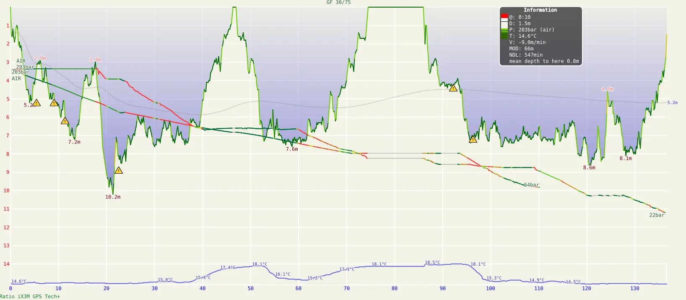

## Resultado

### Topografía

#### Planta y Perfil
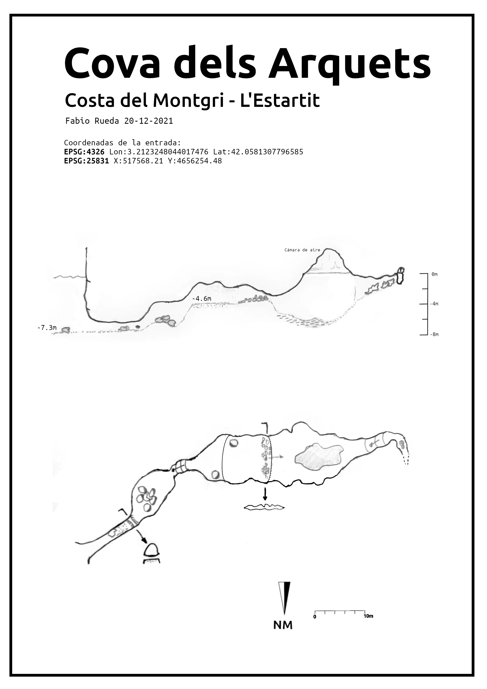

Dejo aqui tambien el [pdf](topo_arquets.pdf) 

#### Render en 3d

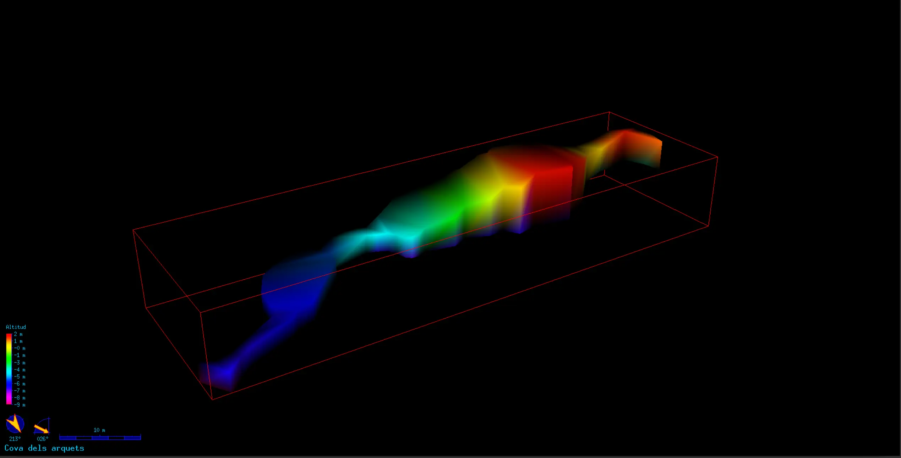

### Video

Esta el video en mi canal de youtube

### Georeferenciación

El [kml](cova_dels_arquets.kml) con la topografia georeferenciada

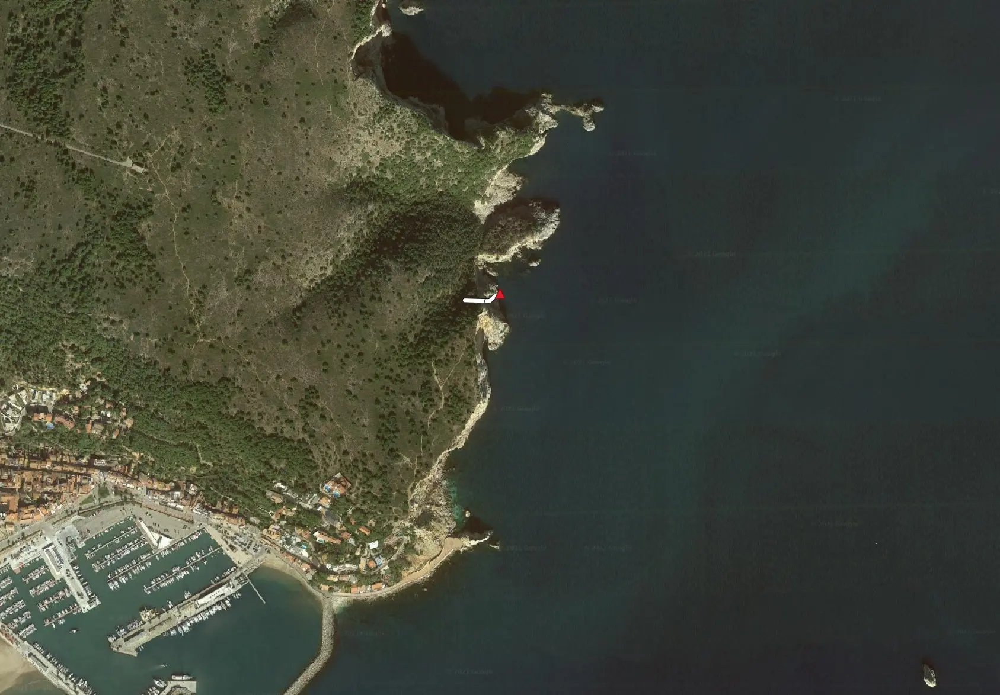

### Referencias
* [espeleoindex](https://espeleoindex.com/crearPDF.php?id=4337)

### Estado de la cueva
Queda un hilo instalado despues de la ventana de la entrada, que quitare en el corto plazo, para dejar la cueva como estaba y no provocar que alguien se sienta tentado a usarlo como guia para nada.

## Conclusion

Estas dos inmersiones han sido maravillosas por dar un paso mas en mi hobby como buceador, no solo buceando en una cueva sin informacion previa, sino creando dicha informacion, con toda la humildad y la ilusion posible, divirtiendome por el camino, y descubriendo una nueva aficion fuera del agua, de documentar y dibujar para crear algo que pueda servir a mi comunidad de buceador@s.

Pero por supuesto faltan muchas cosas por mejorar que requeiren seguir sumergiendome:

* La poligonal fue muy precaria y no esta acabada, hay que volver a empezar de cero con un solo carrete, fraccionarlo correctamente en las estaciones adecuadas y tomar los datos. 

* Hay que grabar y documentar mucho mejor la restriccion para poder ayudar a futuros buceadores con el punto mas complicado de la cueva.

* Hay que revisar la punta por si queda algun agujero por donde meternos.

Para todo esto requiero un scooter para no perder 30 min de natacion hasta la cueva. Todo esto lo explicare en el proximo post :)

