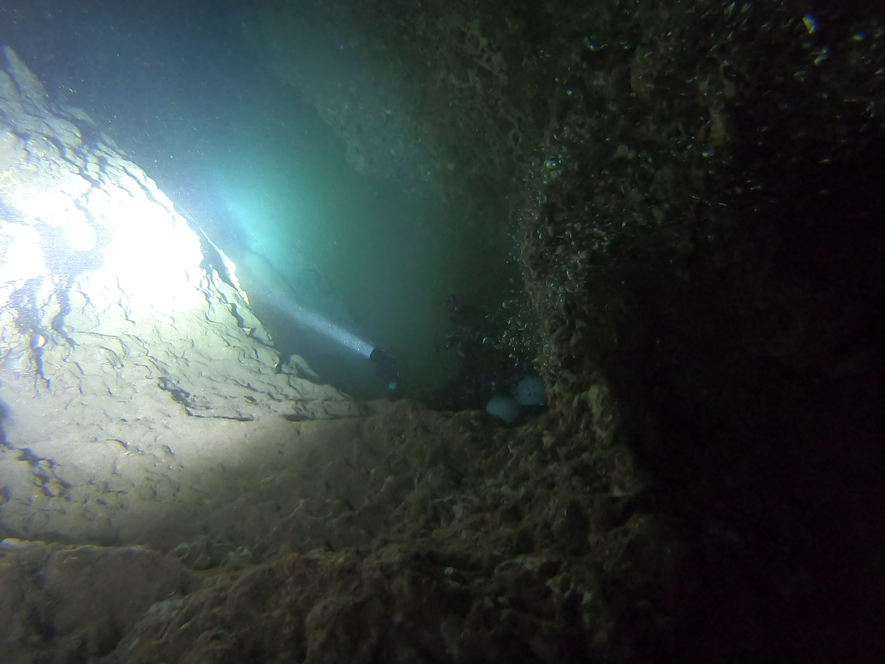
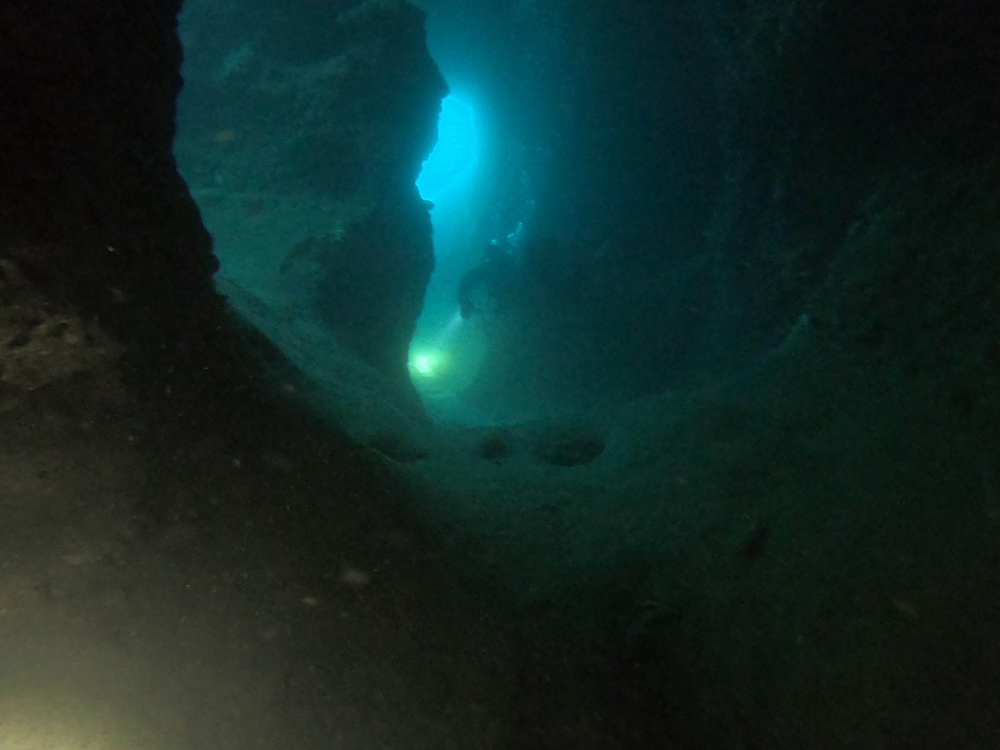
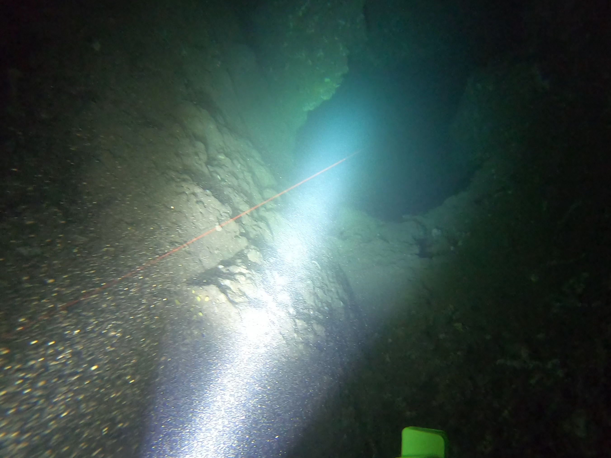
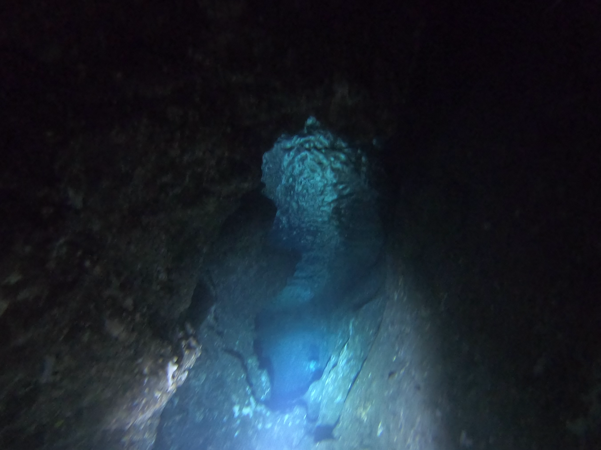
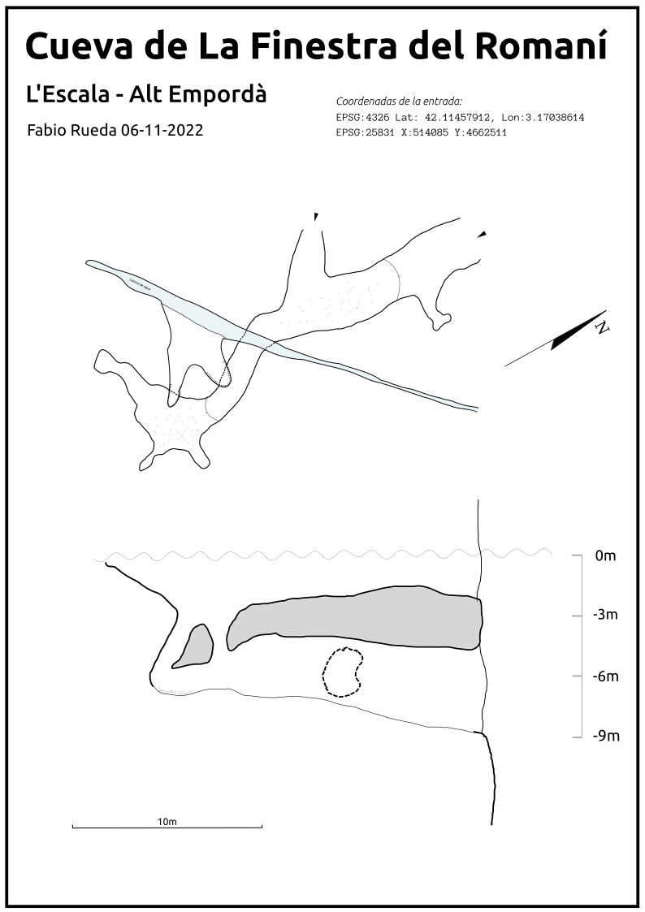

# La exploracion de la Cova de la Finestra

Esta cueva está en la costa de l'Escala, en la pared que hay entre Illa Mateua y Cala Montgo, cerca de una punta llamada El Romaní, y hablando mas en terminos toponimicos de buceo, entre los puntos de "La Depuradora" y "La Xinxa". Forma parte del conjunto de cuevecitas que existen en esta zona. 

## Plan de trabajo

Igual que en las otras cuevas que he topografiado en la zona, el trabajo es el mismo, consiste en viajar desde illa mateua en scooter hasta el punto, pasando por la depuradora y la pared hasta cerca de punta grossa. Intento meterme por las galerias mas significativas y depsues de verla entera, hago otra inmersion con el carrete, y mi sistema de topografiar.

## Descripcion de la cueva

Una vez ahi, se ven dos entradas grandes , cuando se entra por el pasillo, gira a la izquierda y se pierde el azul del mar y se pueden ver bastantes gambas y langostas, se llega rapido a una salita pequeña y mirando hacia arriba se puede ver tuneles que suben hasta el nivel de mar. Es importante si se sube hasta arriba estar pendiente de que el mar no se mueva como para chocar contra las paredes o el techo. Se puede sacar la cabeza fuera y admirar el azul del mar al fondo.

## Exploracion

He entrado varias veces en varias inmersiones, primero he intentado seguir hacia dentro en la galeria superior pero no hay forma humana de seguir por el agujero. Despues he hecho la topografia con un par de carretes para unir la planta inferior y la superior y con el segmento de hilo de 1m.

## Fotos relevantes

## Topografia

Pese a que faltan por aparecer galerias en el techo y alguna en los laterales por donde dificilmente cabe una persona, esta es la topografia de la cavidad

## Video comentado



