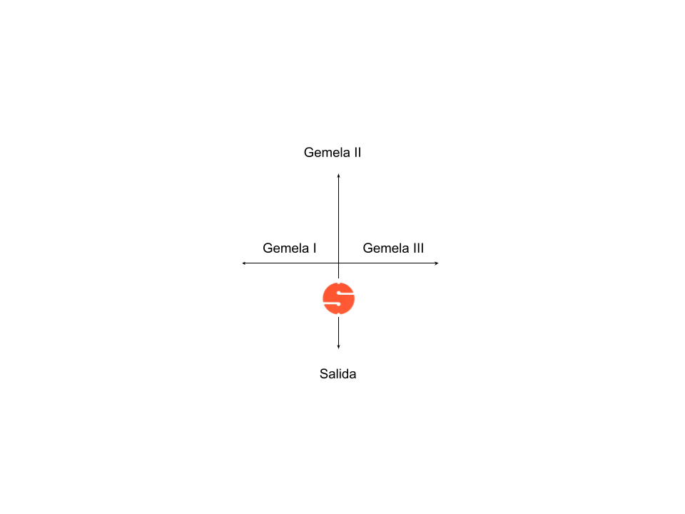
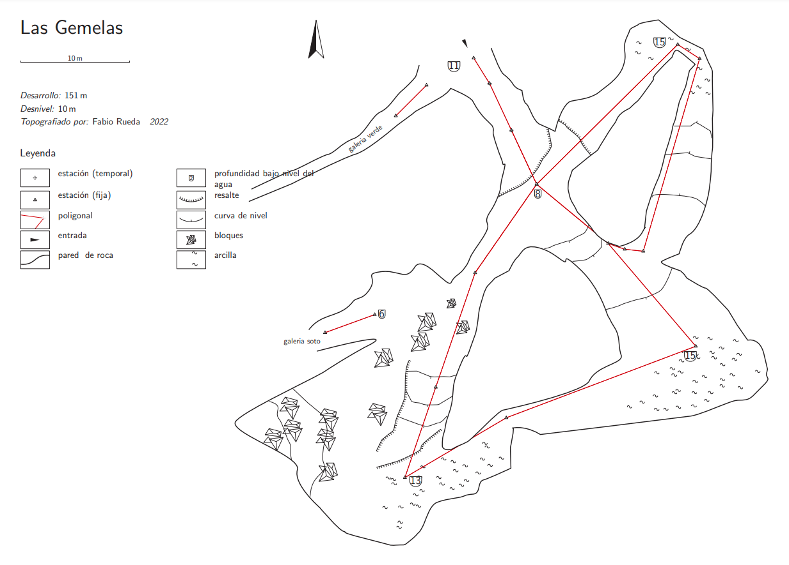

## Introduccion
Estas galerias en cueva del agua estan a unos 30m - 40m de la lamina de agua en la entrada de Cueva del Agua (CDA). Normalmente los buceadores vamos rumbo al cartel y el hilo principal, pero antes de anudarlo en dicho hilo, podemos hacer una incursion atando nuestro carrete al hilo que nos conducen a estas galerias, valen muchisimo la pena.

A mi siempre me han parecido muy accesibles y comodas para entrenar y ganar horas de agua en galerias secundarias, sobre todo ultimamente en la galeria soto, donde se puede entrenar la visibilidad cero por completo todo lo que tu quieras.

Para seguir mejorando en mi entrenamiento tanto en el agua como en el ordenador, he hecho una topografia por completo de estas tres galerias para que cualquier buceador pueda beneficiarse de ella, darlas a conocer y poner en valor. Para los estudiantes es genial porque esta muy cerca de la entrada y quiza les sirva bastante para poder hacerse una idea y planificar mejor cualquier entreno.

## Explicacion del conjunto de las galerias
Para encontrar la entrada hay que navegar por la caverna rumbo ~45º como siempre, pero siempre con nuestra mirada puesta en la parte derecha de la cueva, facilmente se vera un pequeño yunque, a mi me recuerda al hermano pequeño de la piedra caracteristica al bajar desde la entrada, pero esta vez mas pequeñito y con su base en un lateral de la piedra, en lugar del suelo. Es dificil ver el hilo puesto que nace ortogonalmente a nuestra direccion de 45º, es decir, nace hacia dentro de la cueva segun estamos mirando asi que no podremos ver hilo facilmente desde el recorrido habitual por la caverna.

Voy a narrar el recorrido que yo estimo mas habitual y recomendable para explorar todas las galerias, al menos hasta donde yo he llegado

### Galeria Verde
Una vez encontrado el hilo, podemos atar nuestro carrete y en unos escasos metros podremos ver una galeria que nace a nuestra derecha, con hilo instalado. Podemos hacer un salto y visitar la Galeria Verde, una galeria que se estrecha hasta un nivel donde yo no he podido pasar sin soltar el hilo, pero ahi esta instalado a menos a fecha del 2022, no se que valiente ha logrado instalarlo pero todo mi reconocimiento. Por supuesto la vuelta sera con bastante turbiedad pero rapidamente volveremos a nuestro spool de salto sin problemas.

### Entrada y encrucijada en cruz
Si seguimos el hilo, pronto encontraremos una pared que deberemos ascender y donde nuestro compañero podra admirar la belleza de la cueva si enfocamos al techo y vamos iluminando toda la sala que nos espera un poco mas arriba.

Nada mas subir la pared, encontraremos el nuevo nivel y en el suelo alli mismo, una cruz que nos dirige a cada galeria, debemos señalizar nuestro camino como ya sabemos.

### Gemela I
Una vez señalizada nuestra vuelta en la cruz, tomamos el hilo de la izquierda y nos enfilamos por una galeria donde hay un escalon hacia abajo con agua totalmente cristalina, es muy clara y pronto se divisa un giro del hilo a la derecha sobre un lecho de barro enorme que la hace espectacular, cabe decir que en este punto del buceo, hay que extremar nuestro control de la flotabilidad y el aleteo para no amargar a los buceadores que vayan detras. Antes del giro se atisba algun par de agujeros muy pequeños que hacen soñar con la union hacia la caverna, quiza algun dia con mas valor, o quiza algun aguerrido ya lo haya conseguido.

Giraremos 90 grados en una estrechez que nos hara sentir aventureros y empezaremos la subida por la galeria II

### Gemela II
seguimos subiendo lentamente puesto esta galeria tiene el techo mucho mas cerca y hay que ir aun mas finos si cabe, a nuestra izquierda se ve como la ladera cae a mas profundidad pero es muy recomendable estar pendiente del hilo aqui, puesto que se pega muy a la derecha donde el techo estrecha mucho la vertical de la galeria.

Pronto llegaremos a una T y veremos a nuestra derecha la cruz donde comenzamos nuestra andadura, llegaremos por el hilo "de arriba" si miramos la cruz al entrar, veremos nuestra cookie en el hilo de la cruz que esta a enfrente, que nos indica la salida total de las gemelas. Si en esta posicion giramos a la izquierda iremos la gemela III

### Galeria Soto
Volmemos a adentrarnos hacia la cueva, esta vez rumbo al mar, subiremos un poquito donde podremos advertir la haloclina de la cueva, que hay a estas profundidades, en este punto la sala se abre mucho y junto con la haloclina y la facilidad del buceo da tiempo para disfrutarla al maximo. Despues comenzaremos a bajar siguiendo el hilo, en este punto, si lo abandonamos haciendo un salto hacia la derecha, y avanzamos sin miedo hasta la pared, lograremos encontrar la galeria soto, una galeria que une la zona del mar con esta zona, podemos atar nuestro spool a este hilo y meternos por esta galeria mucho mas tenica y ratonera, donde podremos ponernos a prueba psicologicamente puesto que ademas de derrumbarse mucho el techo, sabemos que cada metro que avanzamos sera un metro en visibilidad cero completa a la vuelta.

### Gemela III
Siguiendo por el hilo principal, seguimos bajando hasta que llegamos a la base como en la gemela I y II donde comenzaremos a ver suelo lleno de lodo, girando a la izquierda y pasando un pasillo un poco mas estrecho, llegaremos a otra sala igual de profunda donde podremos navegar encima del area mas grande de puro lodo mas accesible de CDA. Llegaremos a una estaca que completa el bucle y sigue hacia arriba hasta la cruz donde empezamos, una vez mas encontraremos nuestra cookie enfrente, la recogeremos, y saldremos, habiendo disfrutado de un buceo fantastico en este conjunto de galerias.

## La topografia
El proceso de topografia ha sido muy sencillo, el agua y el hilo facilitan muchisimo el trabajo y al ser tan poco profunda los 150m de hilo se han topografiado en un par de pasadas, una para la poligonal, y otra para el video y posterior dibujo en casa.

No asi las galerias Verde y Soto, que muy por el contrario se hace imposible mantenerse quieto mas de 20 segundos para poder escribir los datos, sin acabar perdiendo la visibilidad por completo.

[Aqui el link en pdf](cave_m.pdf)

## Conclusion
Espero poder compartir esta topografia y que ayude a planificar buceos de manera mas detallada, en esta galeria, para mi las gemelas han sido y son parte de mi entrenamiento y una Cueva del Agua en miniatura, donde podemos disfrutar de casi todas las cosas caracteristicas de la cueva, cruces, agua muy cristalina, haloclina, lodo, y todo el agua turbia que tu quieras (o puedas) soportar.

