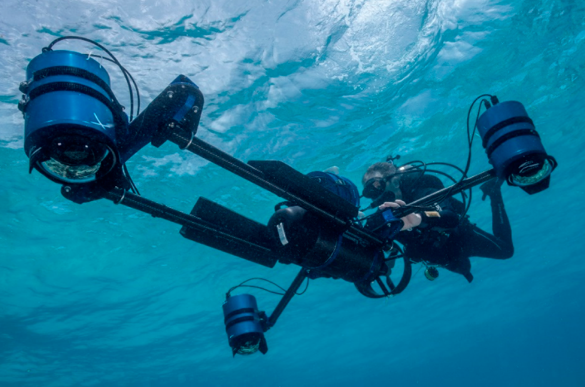

# Que es?

La fotogrametría es una técnica que se utiliza para medir y analizar imágenes de alta resolución para obtener información precisa y detallada sobre la forma, el tamaño y la posición de los objetos en la imagen. Esta técnica se utiliza a menudo en aplicaciones como la cartografía, la topografía, la ingeniería y la agricultura.

La fotogrametría se basa en el principio de que una imagen de alta resolución puede proporcionar información precisa sobre la forma y el tamaño de los objetos en ella. Esto se logra mediante el uso de software especializado que analiza las imágenes y calcula las distancias y las dimensiones de los objetos.

Para llevar a cabo un análisis fotogramétrico, es necesario tomar imágenes de alta calidad desde diferentes ángulos y con diferentes niveles de detalle. Estas imágenes deben ser tomadas con cámaras especializadas que tienen una alta resolución y una precisión de medición.

Una vez que se han tomado las imágenes, se utiliza software especializado para analizarlas y calcular las distancias y las dimensiones de los objetos. Este proceso se conoce como correlación de imágenes y se lleva a cabo mediante el uso de algoritmos especializados que comparan las imágenes y calculan las diferencias de distancia y tamaño entre ellas.

En resumen, la fotogrametría es una técnica que se utiliza para medir y analizar imágenes de alta resolución para obtener información precisa y detallada sobre la forma, el tamaño y la posición de los objetos en ella. Esta técnica se basa en el principio de que una imagen de alta resolución puede proporcionar información precisa y se utiliza a menudo en aplicaciones como la cartografía, la topografía, la ingeniería y la agricultura.

# Cuales son las tecnicas mas usadas?

Existen varias técnicas que se utilizan en la fotogrametría para medir y analizar imágenes de alta resolución y obtener información precisa y detallada sobre la forma, el tamaño y la posición de los objetos en ella. Algunas de las técnicas más comunes son:

Fotogrametría aérea: es una técnica que se utiliza para tomar imágenes desde una perspectiva aérea, utilizando aviones, drones o satélites. Esta técnica se utiliza a menudo en la cartografía y la topografía para obtener información precisa sobre el terreno y las características del paisaje.

Fotogrametría estereoscópica: es una técnica que se utiliza para tomar imágenes desde dos ángulos diferentes y compararlas para calcular la distancia y la posición de los objetos en la imagen. Esta técnica se utiliza a menudo en la ingeniería y la arquitectura para medir y analizar estructuras y edificios.

Fotogrametría de interferometría: es una técnica que se utiliza para medir la deformación y el movimiento de la superficie de la tierra. Esta técnica se utiliza a menudo en la geología y la ingeniería para evaluar el riesgo de deslizamientos de tierra y otros desastres naturales.

Fotogrametría móvil: es una técnica que se utiliza para tomar imágenes desde un vehículo móvil, como un coche o una bicicleta. Esta técnica se utiliza a menudo en la cartografía y la topografía para obtener información precisa sobre el terreno y las características del paisaje.

En resumen, las técnicas más comunes de la fotogrametría incluyen la fotogrametría aérea, la fotogrametría estereoscópica, la fotogrametría de interferometría y la fotogrametría móvil. Cada una de estas técnicas se utiliza para medir y analizar imágenes de alta resolución y obtener información precisa y detallada sobre la forma, el tamaño y la posición de los objetos en ella.

# Se puede hacer debajo del agua?

Sí, es posible hacer fotogrametría submarina, que es una técnica que se utiliza para medir y analizar imágenes de alta resolución tomadas debajo del agua. Esta técnica se utiliza a menudo en aplicaciones como la cartografía submarina, la topografía submarina y la investigación científica.

La fotogrametría submarina se basa en el mismo principio que la fotogrametría terrestre, pero se utiliza para analizar imágenes tomadas debajo del agua. Para llevar a cabo un análisis fotogramétrico submarino, es necesario tomar imágenes de alta calidad desde diferentes ángulos y con diferentes niveles de detalle. Estas imágenes deben ser tomadas con cámaras especializadas que tienen una alta resolución y una precisión de medición.

Una vez que se han tomado las imágenes, se utiliza software especializado para analizarlas y calcular las distancias y las dimensiones de los objetos. Este proceso se conoce como correlación de imágenes y se lleva a cabo mediante el uso de algoritmos especializados que comparan las imágenes y calculan las diferencias de distancia y tamaño entre ellas.

En resumen, la fotogrametría submarina es una técnica que se utiliza para medir y analizar imágenes de alta resolución tomadas debajo del agua. Esta técnica se basa en el mismo principio que la fotogrametría terrestre y se utiliza a menudo en aplicaciones como la cartografía submarina, la topografía submarina y la investigación científica.

# Fotogrametria con gopro

