En dos dias voy a ir a bucear este pecio y como no podia ser de otra manera, me he puesto a investigar sobre su historia, en las webs de buceo no se habla en ningun sitio de su pasado ni mostrado ninguna foto del barco antes de hundirse asi que hago este post para dejarlo por aqui.

# El pecio marmoler
El pecio Marmoler, otro barco hundido en la Costa Brava, concretamente en el municipio de l’Escala en Girona, lo podemos encontrar a una profundidad aproximada de entre 38 y 44 metros. Es un pecio de los auténticos, en el sentido de que no ha sido hundido adrede sino que fue fruto de un naufragio en el año 1971 por culpa del mal tiempo que generó una tormenta, donde le hizo chocar contra la cost del Montgrí. Lo encontraremos aproximadamente a un milla de la Punta Treca Braços, con un descenso por aguas libres donde iremos viendo la silueta del pecio poco a poco. Se le llama Marmoler porque transportaba bloques y planchas de mármol de Carrara, aún presente dentro de sus bodegas.

Podremos acceder mediante una navegación de una media hora saliendo desde el puerto de l’Escala. El barco hundido se ha escorado ligeramente pero se mantiene a 42 metros de profundidad con el casco aún de una pieza. La zona de proa apunta al Norte y, por lo tanto, la popa al Sur.

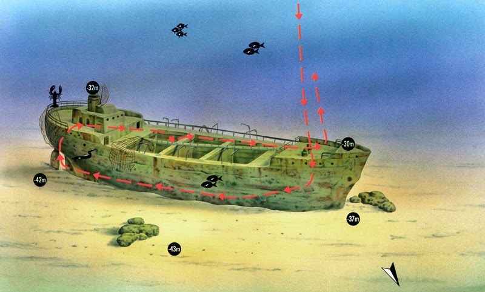

# Sus datos tecnicos

| Variable | Dato | 
| --- | ------- | 
| Fabricante del motor | Deutz AG, Motorenfabrik , Colonia (Köln), Alemania |
| Tipo de motor | Motor, Aceite, 4 tiempos |
| Número de cilindros |	4 |
| Fuerza | 250 |
| Unidad de poder | BHP (APK, RPK) |
| Aterrador. información adicional | Tipo Deutz (11 13/16-17 11/16) |
| Velocidad en nudos | 8 |
| Número de tornillos | 1 |
| Arqueo bruto | 392.00 arqueo bruto |
| Tonelaje neto | 230.00 tonelaje neto |
| peso muerto | 545,00 toneladas de peso muerto (1000 kg) |
| Grano| 24961 pies cúbicos |
| bala|  23000 pies cúbicos |
| Longitud 1 | 48,95 metros de eslora total (Loa) |
| Longitud 2 | 45.18 Metros Longitud entre perpendiculares (Lbp) |
| Manga | 7,70 metros |
| Profundidad | 3,05 metros |
| Calado maximo | 2,81 metros |

# Su historia
## Construccion y puesta operativa
El buque se construyo en Alblasserdam, Paises Bajos, por la naviera NV Industrieele Maatschappij 'De Noord', se vendio el 1930-01-15  con el nombre de **Flying Scotsman** y establecio su base en el puerto de Roterdam

## Primeros años
El barco de carga empezo su andadura cen 1930 con 3 colisiones menores con un vapor aleman en febrero, en el Canal de Kiel y con un velero de madera en Brightlingsea en agosto. Al año siguiente, el capitan del barco lo encalló durante una noche con niebla en la costa Este de Inglaterra, el barco no se hundio y el capitan fue amonestado por el Shipping Council ingles.

## Operacion Neptuno
En 1938-11-09 se cambia el nombre a **Evertsen** y con el estallido de la Segunda Guerra Mundial, huye a Inglaterra en Mayo. 

El mes siguiente, participa en el desembarco de Normandia haciendo de barco de transporte el dia 9 de Junio, 3 dias despues del dia D. El Evertsen fue miembro del convoy EBC-7 que constaba de 28 buques mercantes y que salio de la ciudad inglesa de Barry el dia 9 para llegar a la bahia del Sena el dia 13. Acarreo 392 toneladas de material a la costa francesa.

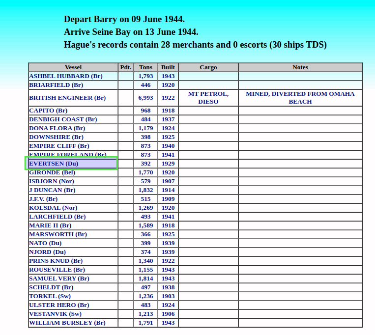

## Ultimos días
En 1062 el barco cambia de dueño a Italia y en 1969 se cambia el nombre a **Avvenire**.
En ruta de Viareggio a Barcelona el dia 17 de Mayo de 1971 con un cargamento de bloques de mármol, encalló durante la niebla en Punta Grossa y se hundió frente a La Escala (costa noreste de España). La tripulación fue rescatada.

## Fotos del buque
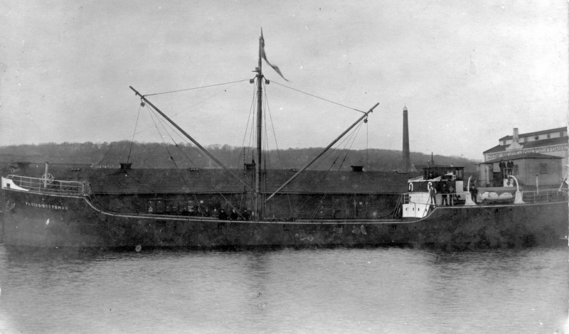
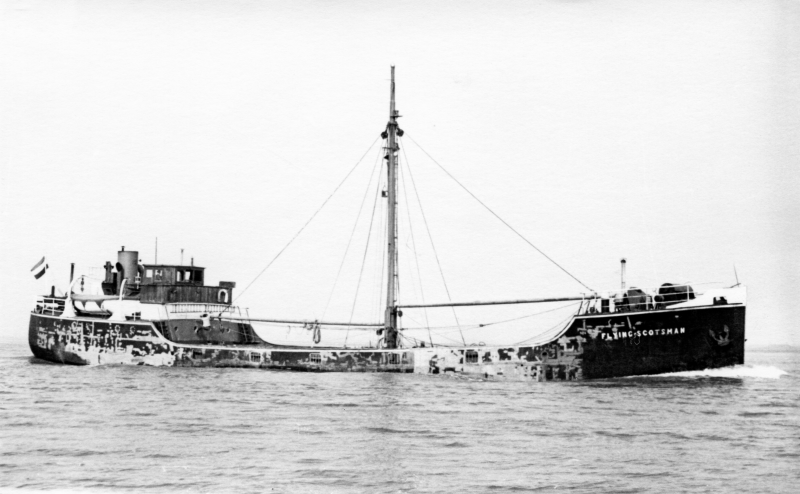
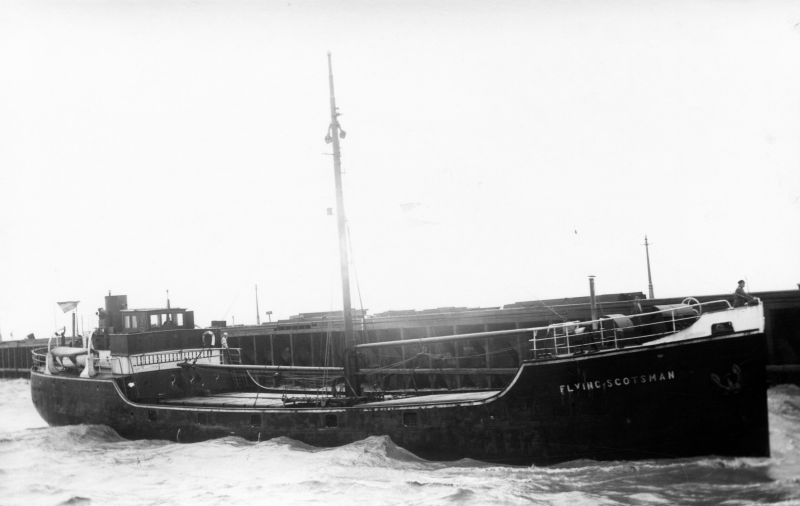
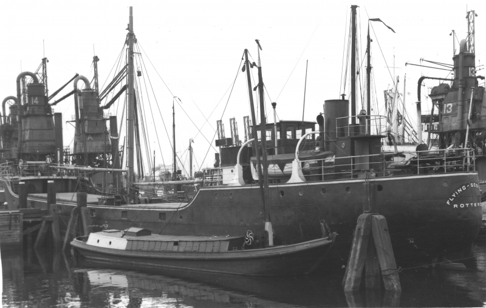

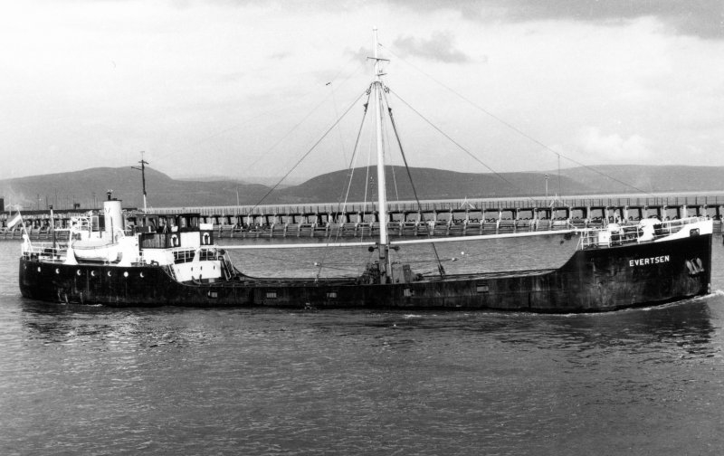
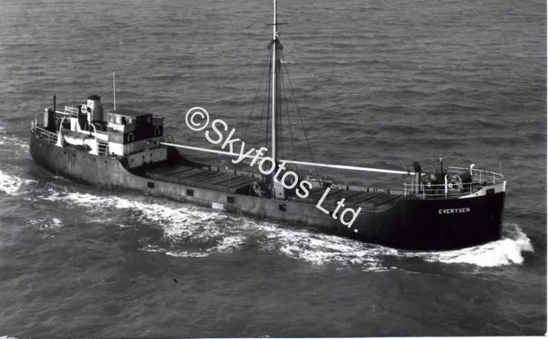
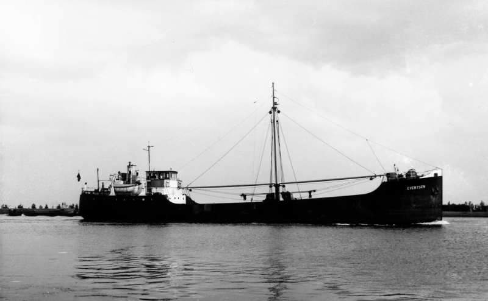
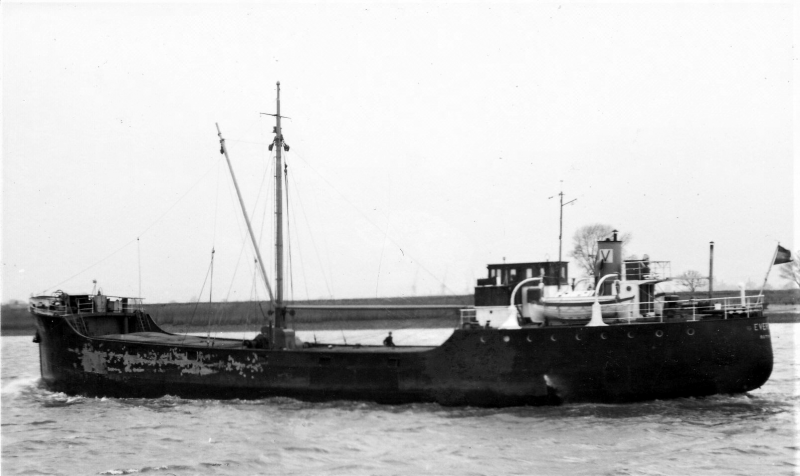

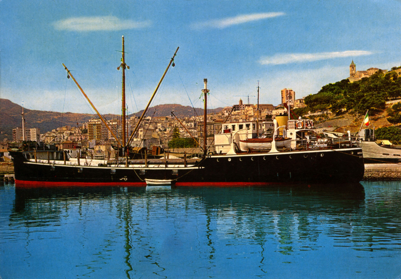
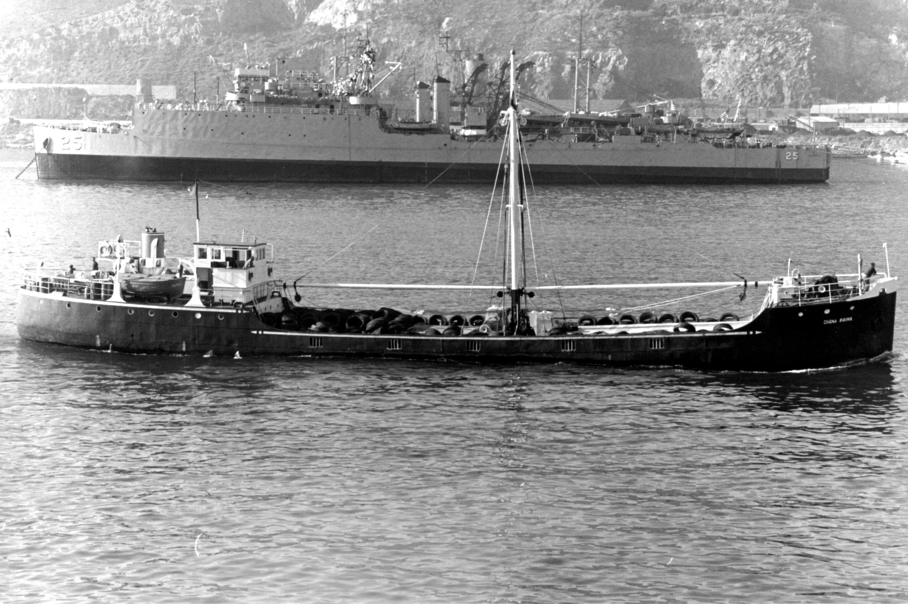
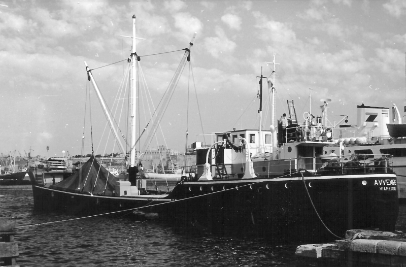

