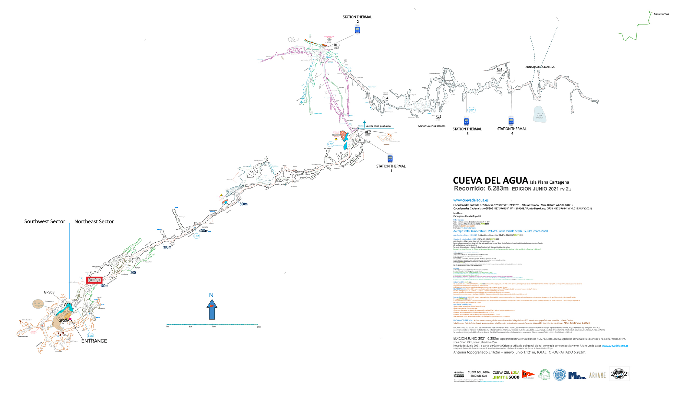
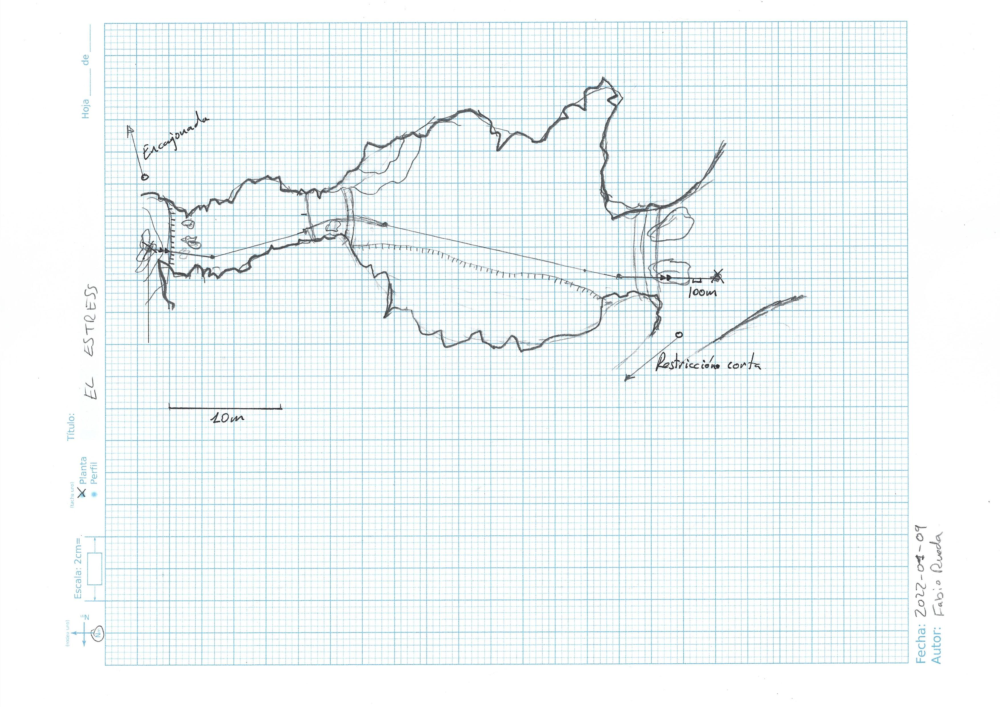
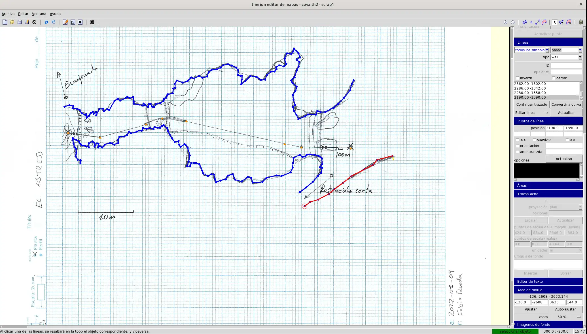
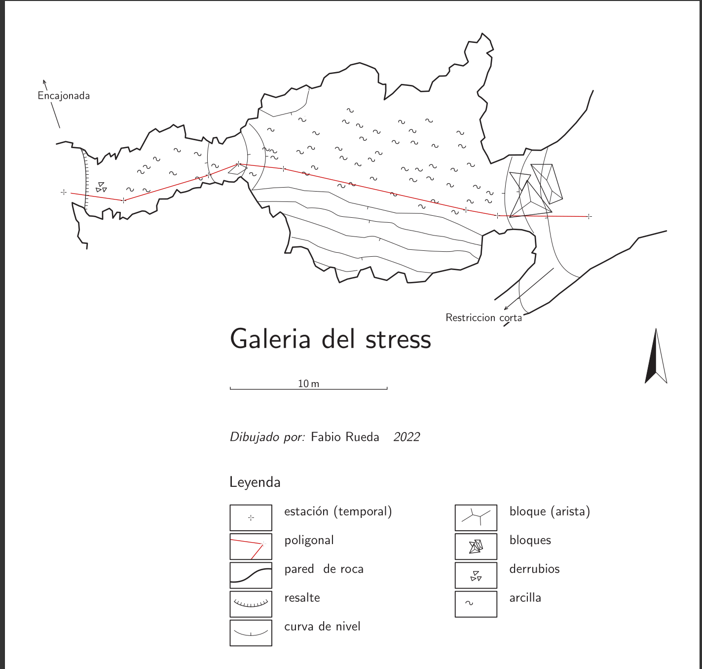

# La galeria del stress en la cueva del agua

## Introduccion

En esta ultima escapada a la cueva del agua, en Murcia, habia pensando en seguir entrenando la topografia subacuatica, y asi lo pude hacer. Por todos es conocida la estupenda [topografia](http://cuevadelagua.es/PLANO-AGUA/planimetria.htm) de la cueva, asi que no iba en absoluto aportar ni por asomo nada _real_ a la topo que ya existe, pero eso no quita que se pueda hacer algo, que sirva para mi entrenamiento y formacion, y a la vez un poco para ayudar a alguien.

Ademas esta vez, estabamos solos en la cueva, no habia mas equipos, y el agua estaba clarisima, como nunca habia visto.

## Antecedentes
Sobre la topografia de la cueva no cabe critica alguna, desde mis inmersiones de formacion me ha ayudado muchisimo, y siempre ha sido muy util para mi, pudiendo llevar mis recuerdos de la cueva rapidamente al mapa, es verdad que hay ciertas zonas, que la topo esta en continuo desarrollo, y de eso se encarga el grupo de exploracion de la cueva. La pongo aqui para ver la dimension de la cueva

## Explicacion del proyecto
La idea que he tenido es hacer topos en planta (el perfil en esta cueva carece de interes), de zonas "miticas" de la cueva y topografiarlas con mucho mas detalle del que existe en la topo oficial. Este detalle no tendria sentido para la topo oficial, puesto que la cueva es mucho mas grande y ademas cumple todas las funciones de informar al buceador de todo lo necesario para su planificacion.

Lo mio es mas una cuestion casi de hacer un ejercicio para clase de un problema conocido,voy a topografiar la galeria del stress en una lamina, que quepa en un A4, de la manera mas detallada posible.

## Realizacion en el agua
La topografia se hecho con los rumbos y distancias de la topo oficial, y todo el detalle, ha sido con el video que grabé para dibujar el plano en casa. El video esta [aqui](https://youtu.be/DeD3MHM8vJw) por si a alguien le interesa. Gracias a la claridad del agua, la galeria del stress pudo ser filmada bastante bien.

## Realizacion en casa
Despues ya en casa, junto con la poligonal y las paredes que iba dibujando gracias al video, (y a pasar muchas veces ya por ahi) logre sacar una planta que me parecia muy aceptable y a varios compañeros que consulte tambien. La pongo aqui:

Con esta imagen, en therion he logrado pasar todos los elementos. Aunque sinceramente creo que a mi me gusta mas el dibujo a lapiz

## Resultado

El resultado despues del trabajo en therion es asi:

Si alquien quiere contribuir y mejorarla, toda la informacion es codigo abierto y esta [aqui](https://github.com/avances123/topografias/tree/master/stress)

