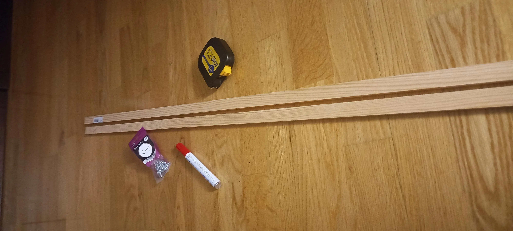
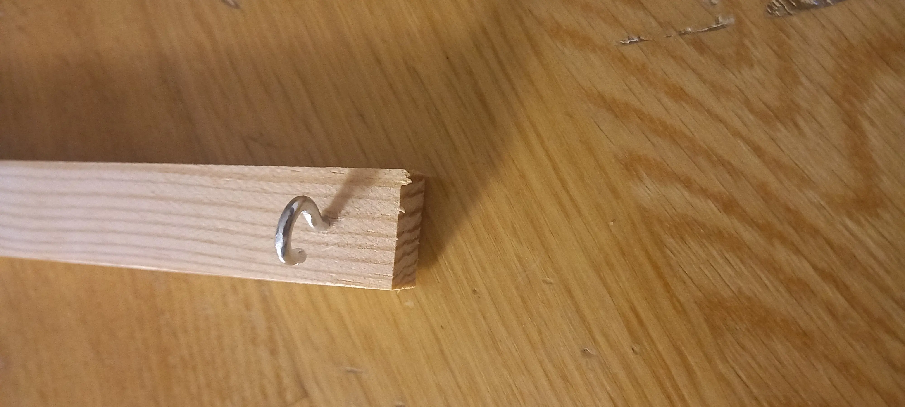
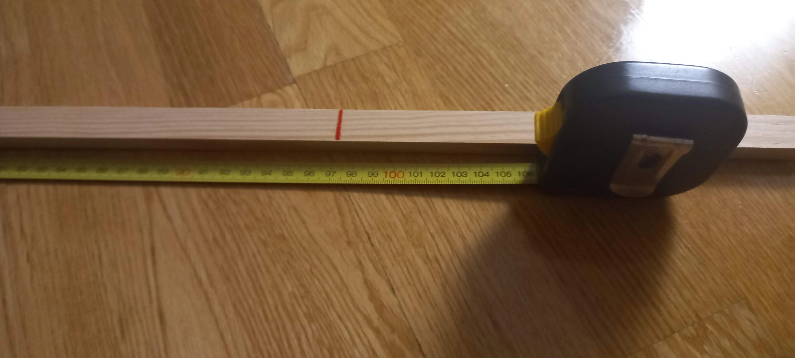
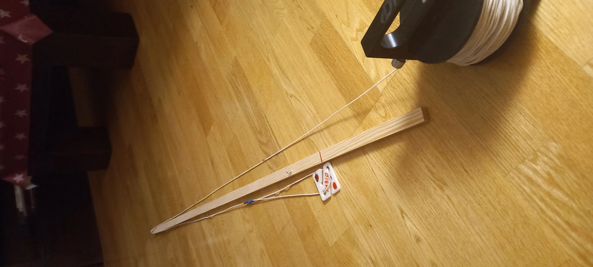
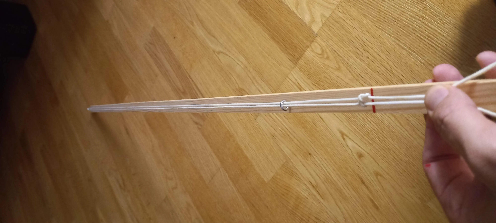
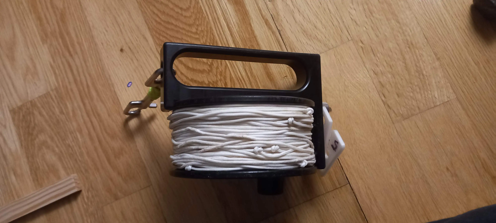
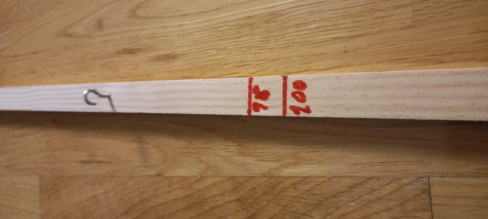

# Cual es el problema

Para poder topografiar en la cueva, (o donde sea que estemos buceando), usamos un carrete como siempre donde poder tirar el hilo, pero este hilo tiene la particularidad de que tiene un nudo cada una distancia pautada, en mi caso 2m. (lo standard en el mundo americano es 10 pies).

La cosa es que tener cientos de metros de hilo, y tener que hacer un nudo cada 2m de manera eficiente y rigurosa, parece una tonteria, pero es compicado, puedes empezar a intentarlo y pronto acabaras frustado con el hilo enredado y no saber por donde pasar el carrete ya.

# La solucion de los pros

Yo solo he copiado a los mejores, en este caso, a Steve Bogaerts una leyenda del sidemount y de la exploracion de las cuevas. En este youtube explica todo el tutorial, que yo he seguido y que cuento aqui.



# Mi propia maquina

Por 4 euros he comprado un liston de 240cm y unas alcayatas

El liston lo he cortado por la mitad, y asi me he quedado con dos listones de 120cm y poder tener dos maquinas. He puesto una alcaya en una extremo del liston y queda asi:

Y una vez el gancho instalado, he medido 1m desde esa alcayata y he dibujado una marca con permanente rojo.

Ahora ya solo queda coger el carrete y empezar a hacer nudos, hay que pasar el hilo a traves de la alcayata teniendo el carrete a mi derecha, la maquina en mi regazo, e ir tirando el hilo a la izquierda. Cuando el nudo que acabo de hacer viaja y vuelve a la marca roja, hago coincidir el hilo y sujeto con los dedos donde corresponde, ahi sera el nuevo nudo.

Se mueve el hilo a la izquierda y se hace coincidir el hilo cuando el nudo vuelva a llegar a la marca roja, y otro nudo pasando el carrete sujetando el hijo para no perder la marca donde hacerlo.

Al acabar , se vuelve a enrollar el carrete como siempre, ayudandote de la propia maquina para lograr tension en el proceso y quede el hilo bien empaquetado.

He puesto dos marcas rojas, una con el metro exacto para hilos muy duros y otro 98cm porque luego en el agua todos se dilantan un poco.

# Conclusión

Este articulo supongo que no servira para nada, excepto para animar a los exploradores a hacerlo tambien o que me contacten para conocer otras formas de hacerlo. Pero el video de youtube lo es todo, lo explica mucho mejor y mas detallado, y ademas con una bobina nueva de hilo en lugar del carrete existente.

He podido crear 2 maquinas muy rapidamente, asi que tengo otra para regalarsela a algun coleguita. XD

