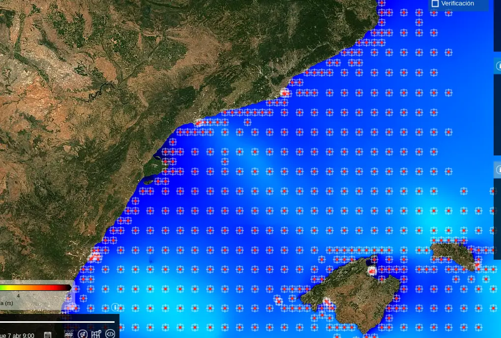
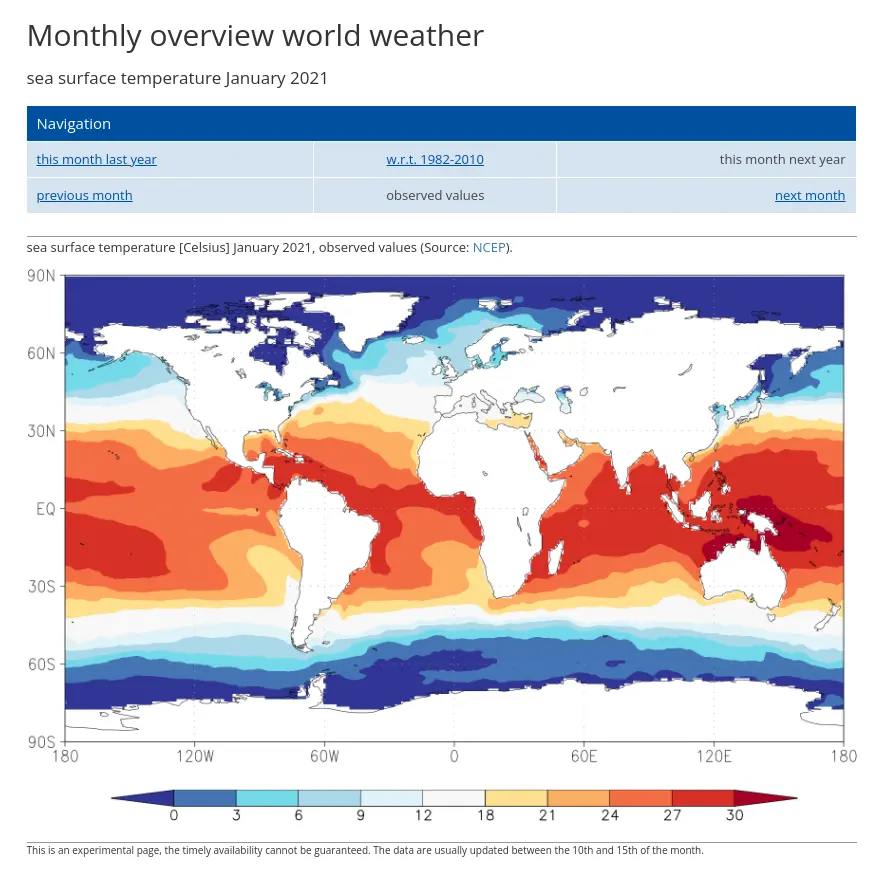

# 测定潜水气象条件

## 引言

每当我们计划潜水时，我们都会担心潜水时海洋的状态。我们钟爱的爱好是在户外和海洋环境中进行的，这使得我们在很大程度上依赖气象条件才能成功潜水。

我认为，制定复杂的潜水计划然后忽视对当天天气的正确解读是没有意义的。天气可能会导致潜水推迟，因此尽可能准确地了解这一点很重要。

当然，几乎每个人都有一种或另一种方式来查看潜水时海洋状态，对于我对这个问题的兴趣，我一直在询问，几乎在所有情况下，人们使用手机上的气象应用程序进行查询。这些应用程序提供有关海浪、风力等的数据，非常方便、免费且随时可用，但在这篇文章中，我将专注于其他一些不那么显而易见但同样有用的信息来源，这些信息将大大帮助我们。

我将专注于一些我没有看到任何人使用过的数据，这些数据我可以为潜水社区提供，文章末尾我会谈到常规应用程序以及我们可以利用的一些隐藏功能来更好地解读和进行改进的预测。

## 需要考虑的气象因素

为了进行正确的计划，我们应该坐在电脑前，并关注涉及潜水的多个天气因素，在这里列出了它们，我们需要知道潜水地点和日期，因为我们需要查询该地点和特定时间的预报。

### 有效波高
在我看来，这是决定潜水可行性的最终因素，需要尽可能精确地预测该点的情况。在伊比利亚半岛，我使用[国家港口](https://www.puertos.es/es-es/oceanografia/AccesoSimplificado)生成的气象模型。该模型利用AEMET的HARMONIE和HRES-ECMWF的风预测来生成未来48小时后的预测。此外，它提供了在港口附近安装的多个浮标的观测数据，这些数据使模型在这些点上得到了很大的改善。

例如，如果我们想了解塔拉戈纳港的龙海遗址的海浪情况，我们可以查看该模型以及它在该点的预测质量。

对于龙海遗址来说，我们非常幸运，因为我们有一个浮标记录了海浪高度的每小时数据。还有其他点，总是有浮标可以帮助预测港口附近的海浪情况，因为我们更关心港口世界而不是潜水者。

这并不意味着我们必须手动插值我们感兴趣的点的预测，模型本身为我们提供了整个模型点阵的预测。因此，我们可以查询我们点的预测。

如果我们查询一个点，我们可以以表格格式查看模型的所有变量数据，不仅是有效高度，我们还可以看到波的周期和方向，波的背景海洋或风的分量等。还有该点的风数据，这对于了解当地风和海况以及观察者经验的另一种方式可能也很有用。

此外，在[copernicus](https://myocean.marine.copernicus.eu/data?view=dataset&dataset=MEDSEA_ANALYSISFORECAST_WAV_006_017)上，我们可以获得Aemet的HARMONIE未改进的WAN模型。

### 水温

这个变量对我们的潜水影响很大，但实际上并没有像其他因素那样进行预测，因为通过年份日期和以前的同一日期的观察，很容易推断出水温。

在[Copernicus](https://myocean.marine.copernicus.eu/light)上，我们可以查询海洋点的温度预测以及分析模型的历史数据。

在这里，我想提供另一个对潜水旅行非常有用的来源，我们想要了解地球上某个点的温度，而这个点又不在我们的经验和纬度范围内，并且想知道该携带什么装备。在[WMO](https://climexp.knmi.nl/monthly_overview_world_weather/index.cgi?var=sst_ncep_w&mon1=jan&year1=2021&anomalie=nee&kort=nee&expert=nee&type=kaartwereld)上，我们可以探索地球上任何地点一个月的平均温度，这并不是非常精确，但可以帮助我们计划一次旅行，知道日期和目的地的温度情况。

另外，NASA还有另一个任务叫做[MUR](https://podaac.jpl.nasa.gov/dataset/MUR-JPL-L4-GLOB-v4.1)，可以全球范围内测量海洋温度，可以用NASA的[worldview](https://soto.podaac.earthdatacloud.nasa.gov/?v=-18.78720059082591,30.727507641081075,21.28282587652165,50.51208320933394)工具来可视化。

### 洋流

这个变量也影响我们的潜水，有哪个潜水员没有梦想过知道哪天没有洋流在那个令人难以置信的沉船？但是，截至目前，我对这个变量了解不多。我看到水平面上有水速的数据，但我还不理解垂直层面上使用的水平线是什么。

在[copernicus](https://myocean.marine.copernicus.eu/data?view=dataset&dataset=MEDSEA_ANALYSISFORECAST_PHY_006_013)上，我们可以看到多个数据集中的洋流数据，这也是在windy上可用的变量，我从未有机会重复多次潜水，以便作为潜水员确认它是否有用，但能够这样做将是非常棒的。

### 雨水和风

虽然也要考虑这些变量，但我至少认为它们不那么重要，尽管它们可能会导致我们关注其他方面，比如**能见度**，通过研究过去的雨水和暴风天气，我们可以推断出能见度的好坏，例如。

我们也可以计划是否要乘坐帆船，或者如果携带装备要求我们在雨中行走或其他一些奇特的原因可能会影响我们，但无论如何，我建议查看下一节有关常规应用程序的内容。

## 常规途径

要查询某一点的天气情况，我们将使用[windy](https://windy.com)，虽然还有其他一些应用程序，但是这个应用程序正在变得相当流行，它整合了最多的图层、模型和数据，因此建议在进行严肃的计划时，尽可能使用电脑而不是手机，这样我们可以利用应用程序的所有界面。在这里，我们可以查看前面描述的所有变量的信息，我们在特定时间的任何地点都可以得到预测，不仅仅是在伊比利亚半岛。

除了在这里查询海浪情况外，我们还可以更多地查询“当天将会如何”，（温度、雨水和风）为了这个目的，我们不建议打开应用程序并查看它给出的第一个预测，我建议使用这些变量的**多模式**视图，这里我会说明一下如何操作：

这将有助于我们确定预测中的共识或模型之间的分歧。尽管这只是查看天气的一种方法，但通过从4或5个来源查看，我们可能会对模型为特定时间点的特定地点所拥有的不确定性有更清晰的认识。
