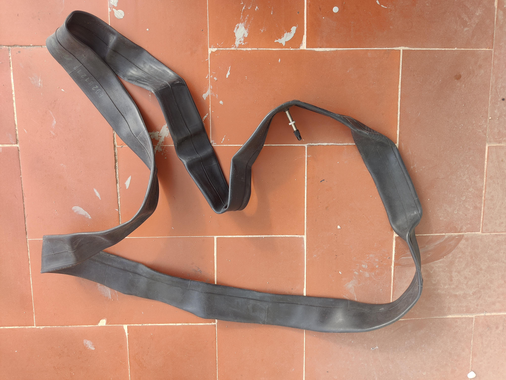
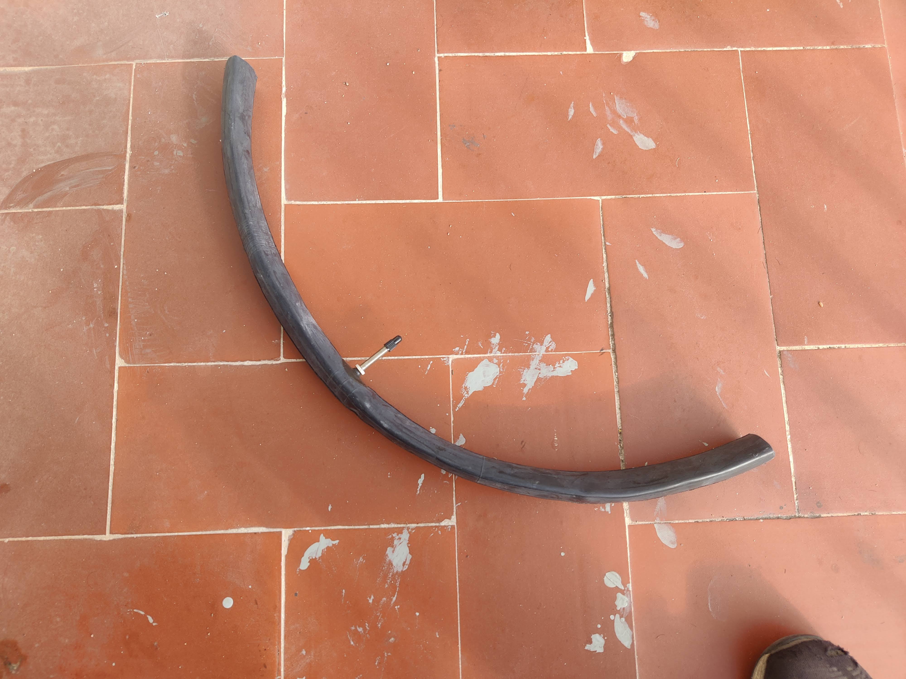
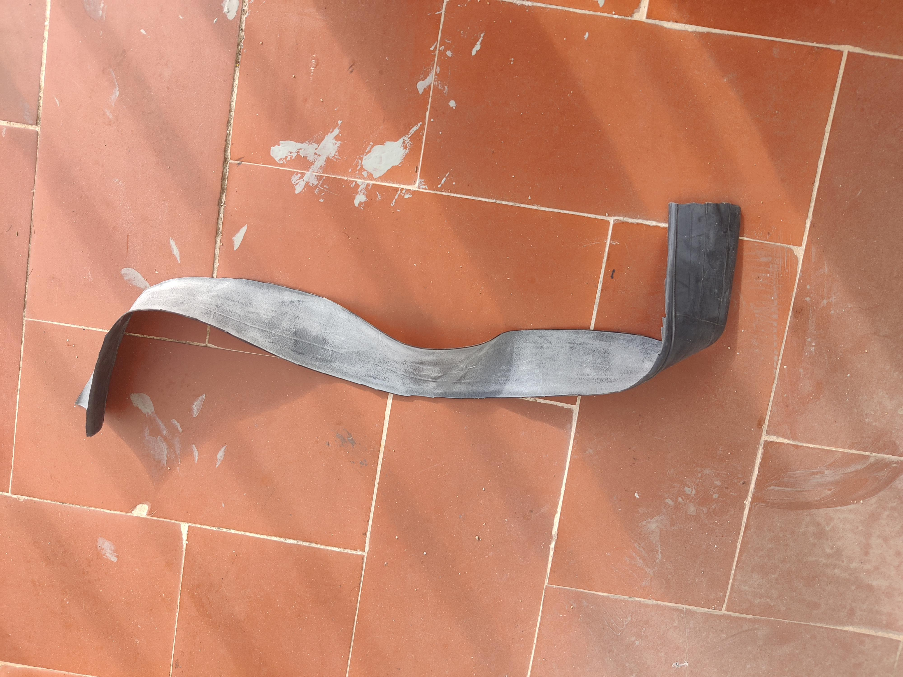
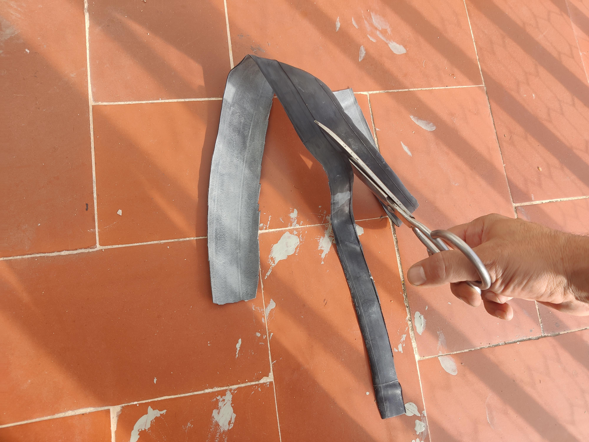
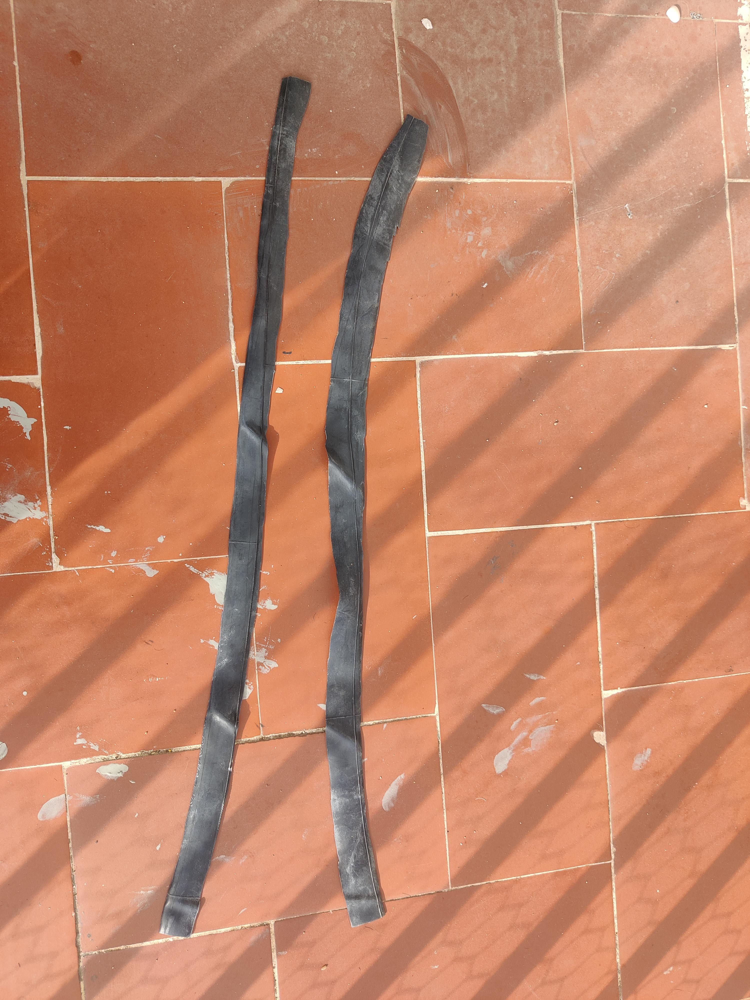
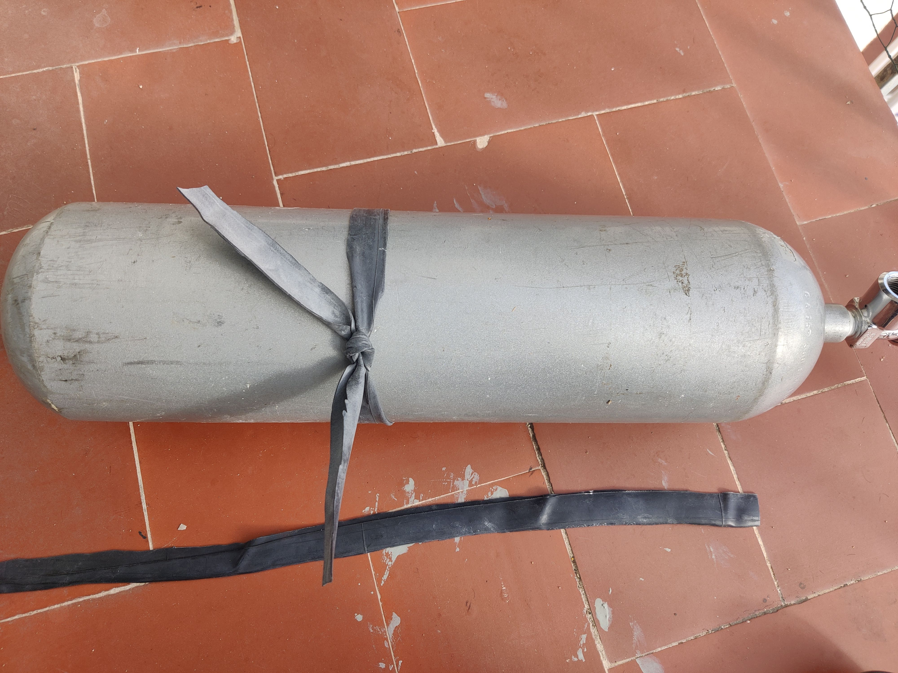
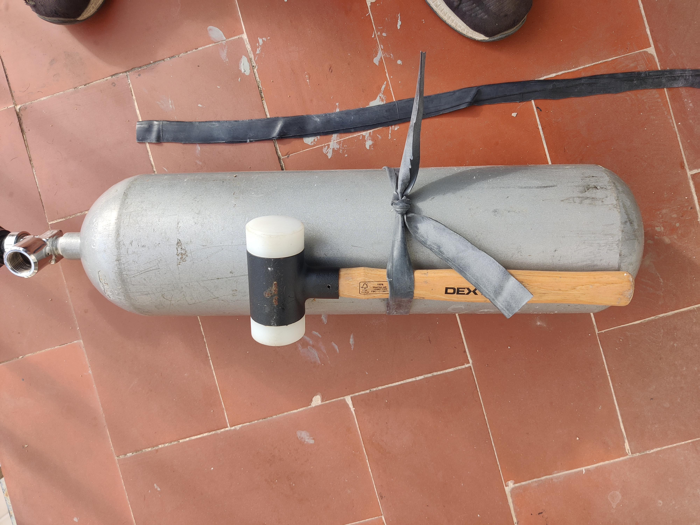
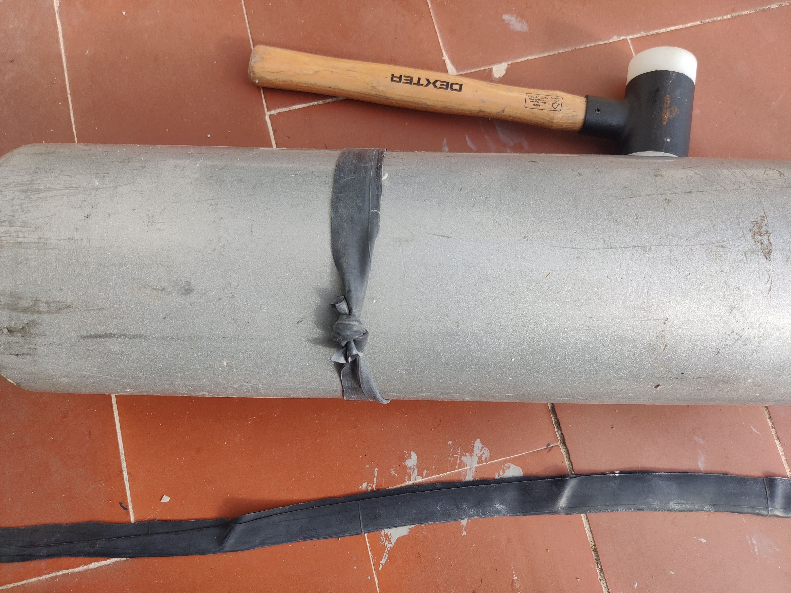

## Cual es el problema

Los retenedores de latiguillos para reguladores de buceo comerciales son costosos considerando su función relativamente básica: asegurar los equipos durante el transporte. Su principal tarea es mantener todo en su lugar, lo cual es importante, pero su precio puede representar un desafío financiero, sobre todo si se necesitan para múltiples botellas. Esto puede resultar en un gasto adicional considerable para los buceadores, añadiendo una suma significativa al presupuesto, especialmente si tienen varias botellas para equipar.

## La solucion

Reutilizar cámaras de bicicleta viejas o pinchadas para hacer retenedores de latiguillos baratos es una movida genial de reciclaje. Vale, no queda tan chulo ni tan a la medida como los que venden, pero ¿sabes qué? ¡El ahorro es enorme! Claro, tienen una vida útil más corta y pueden romperse o soltarse más fácilmente, pero yo creo que el bajo costo hace que valga la pena el riesgo. Además, ¿quién no quiere darle una segunda oportunidad a algo que de otra manera sería basura? ¡Es una forma ingeniosa de mantener los latiguillos en su sitio sin gastar un dineral!

## Proceso de fabricacion

### Reciclar
Se coge una camara de bici que tengamos pinchada o inutil, si no tenemos se puede comprar, sigue siendo mucho mas barato.

### Cortar transversalmente
Se corta con unas tijeras el largo que deseamos, debe ser aproximadamente del diametro de la botella que queremos equipar, puesto que con la distancia que robaremos para hacer el nudo, quedara con la presion adecuada.

### Cortar longitudinalmente
Una vez tenemos el tubo cortado, con las tijeras cortamos longitudinalmente para ese tubo, convertirlo en un rectangulo.

### Hacer fettuccini
Ya solo nos queda usar las tijeras para volver a cortar longitudinalmente el rectangulo de goma, usando el grosor que queramos para nuestros retenedores

### Anudar en la botella

Ya solo nos queda hacer bastante fuerza para tensar la goma todo lo posible y hacer un nudo fuerte para que quede apretado

### Comprobar estabilidad
Podemos probar si la tension es la adecuada, a mi me ha quedado perfecto como si fuera un retenedor comercial

### Recortar lo sobrante
Ahora quitamos con las tijeras la goma sobrante en el nudo, podemos dejar un poquito para luego poder usarlo como ayuda para estibar

## Conclusión

Puede dar la impresión de ser algo improvisado o propenso a romperse enseguida, o que el nudo podría convertirse en un punto débil potencial, sí. Sin embargo, esta solución es realmente económica y hasta el mismo nudo podría funcionar como el tipo de añadido que suelen tener los productos comerciales para facilitar su agarre.

