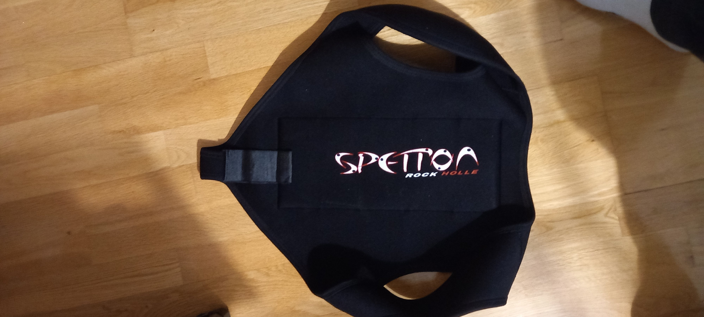

# Me gusta el acero ligero

Yo soy un buceador que bucea en sidemount, y tengo dos botellas de acero ligero, me parecen las mas versatiles, por supuesto cada buceador tendra sus preferencias y nunca nada es la solucion perfecta, y menos en este asunto.

Mis razones fundamentales para usarlas con respecto a otro tipo de botellas, son estas:

* Las de aluminio tienen 11L, estas tienen 12L y se comportan casi igual debajo del agua.
* Las de acero pesado, siempre son negativas y para manipularlas en sidemount debajo del agua es sencillamente imposible.
* Me permite bucear con traje humedo perfectamente

De hecho llevo un par de años usandolas, y cada vez veo mas gente con el mismo tipo de botellas y configuracion.

# Hay un problema con el acero ligero

Despues de enamorarme de las botellas y no parar de bucear con ellas, me he dado cuenta de un caso en el que se torna complicado bucear con ellas,

> En agua muy fria, me pongo una rata gorda que flota mucho, y necesito mas lastre del que puedo meter en el ala de buceo.

Despues de llenar el ala xdeep stealth 2.0 hasta arriba de plomos, me tenia que seguir agarrando a las piedras y cabos para no salir escopetado a la superficie.

# Soluciones que he ido viendo

En todo este tiempo he ido preguntando a otros buceadores sobre este problema y como lo solucionaban, he visto dos soluciones que hace la gente

* Tener otro juego de botellas de acero pesado para esta situacion, no es mala puesto que el 99% de las inmersiones no necesitamos mover las botellas para pasar restricciones, asi que puede ser considerada
* Fundir plomo, y crear bloques mas grandes exactos para maximizar el espacio del ala, se supone que admite 2kg en cada slot, pero asi podrian entrar 3kg creando el bloque exacto. Parece de risa hacer eso pero lo he visto tambien.

# Mi solucion

Realmente no es mia, recuerdo a mi instructor Javier de Miguel, que es un gran apneista (instructor tambien), que usaba un chaleco para apena dentro del traje seco, y eureka! podria llevar 5kg dentro del seco, pegados a mi espalda de manera comoda, y luego lastrar el ala como mas me convenga.

Asi puedo restar 5kg a los bolsillos del ala y poder ir lastrado correctamente con el acero ligero. Digamos que ese peso que dan las botellas de acero pesado a los buceadores de backmount, los pongo en el chaleco de apnea interno.

Aqui la foto del chaleco por si a alguien le interesa:

# Conclusion

Ahora ya puedo bucear con mis dos botellas principales tambien en agua fria y con la rata gorda sin problemas de ningun tipo.

Como siempre, habra otras soluciones o para mucha gente esto sera evidente, pero me gusta documentar los principales escollos a los que me enfrento por si a alguien le puede servir. Espero que si!

