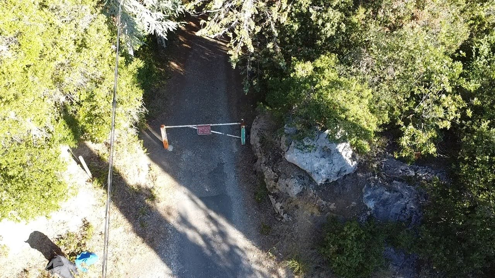
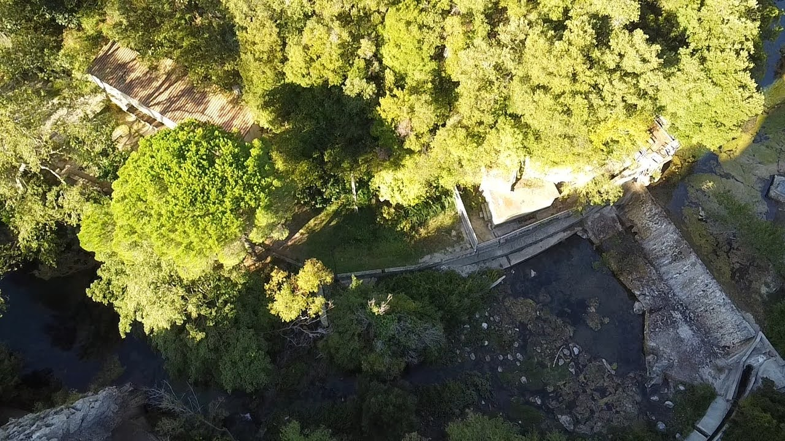
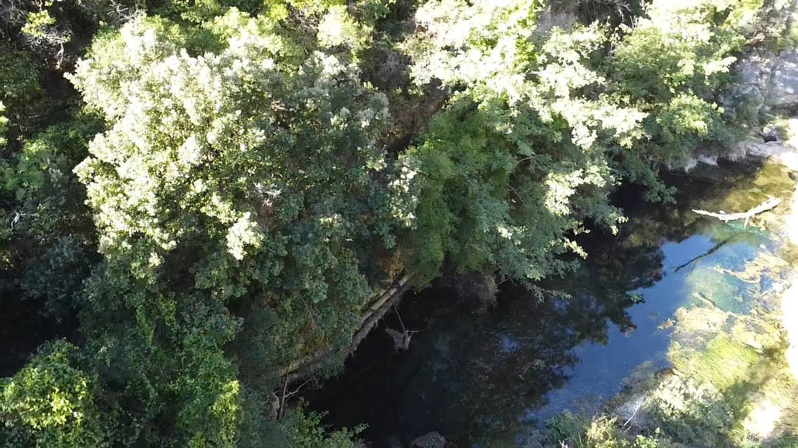
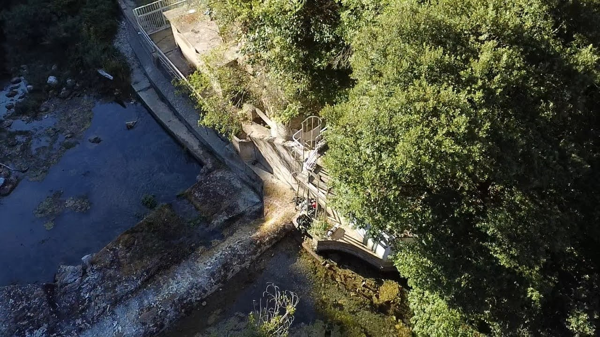
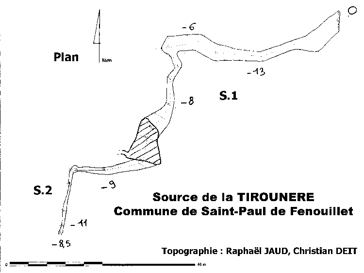
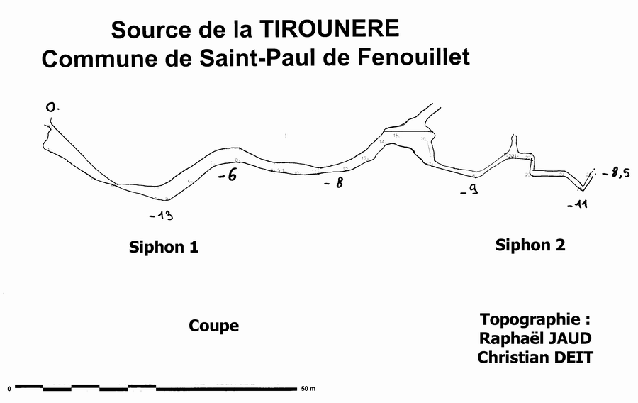
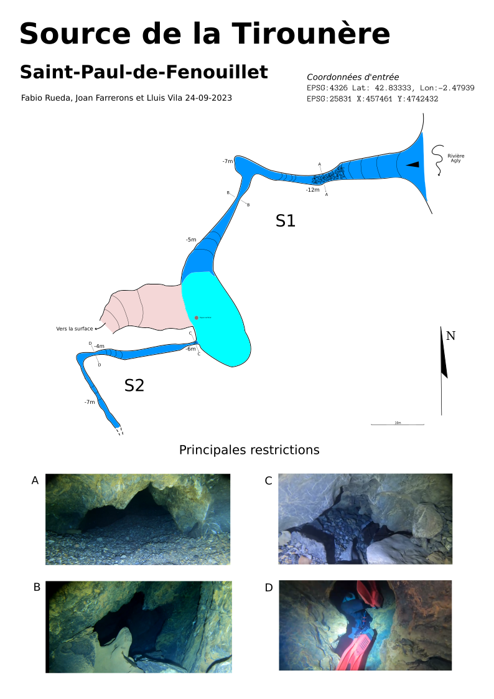
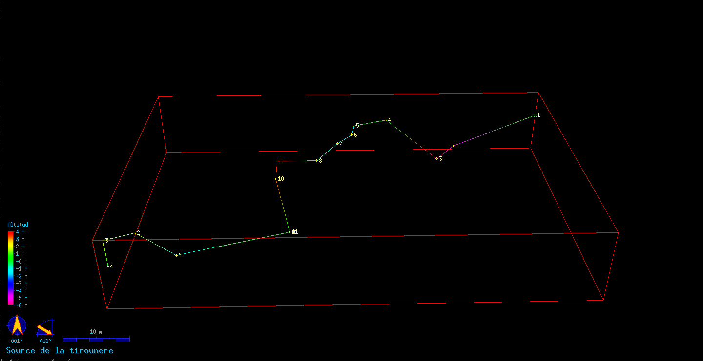
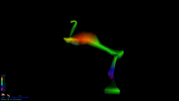

# La topografia de la Source de la Tirounére

Esta cueva la descubri un dia al volver de Lot totalmente enganchado con el espeleobuceo y explorando por internet otras cavidades, di con esta y la apunte en el mapa, puesto que esta a 1h de Estramar y mas o menos cerca de Barcelona. No habia mucha informacion pero parecia lo suficiente para lo tipico de "si algun dia..."

El caso es que ese dia se dio. Un dia fui con Marc Pintor y Delfi Roda a Font Estramar y la gendarmerie aparecio y nos recordo que el acceso estaba prohibido, asi que despues del chasco les hable de esta cueva y que no tenia ni idea de ella pero estaba cerca, y por suerte, ya la conocian!. Asi que fuimos alli y la buceamos, una inmersion cortita pero lo justo para conocerla y poder enamorarme del sitio.

## Entorno

La cueva esta en el pueblo de Saint-Paul-de-Fenouillet en los pirineos orientales en Francia. El pueblo tiene como atraccion turistica las Gorges de Galamus, una garganta preciosa creada por el rio Agly, un poco mas abajo de esta garganta siguiendo el curso del agua, esta la cueva, al lado de un azud del rio, cuya entrada se encuentra en la margen izquierda rio arriba.

Aqui algunas fotos del rio y del camino desde el coche.

### Logistica

El coche se lleva hasta donde acaba el camino y hay una barrera, asi hay que coger todo el equipo y llevarlo al azud del rio, en mi caso, al estar seco ya que el agua no lo saltaba, pudimos dejar las botellas siempre pasando por el margen izquierdo del rio, por la parte derecha, hay unas escaleras para poder subir hasta el rio de manera mas comoda.

Se suben las botellas y equipo hasta el agua, y se retorna al coche para ya por ultimo volver con el traje puesto directo al agua.

## La cueva

Esta cavidad empieza en el rio Agly y tras un zopetero de canto rodado se encuentra una restriccion con corriente en contra debido al estrechamiento y con el canto rodado muy suelto que hace que parezca peligrosa la entrada, tras un ratoneo entre piedras grandes sueltas, se llega a una burbuja donde se puede ver la mano del hombre con tuberias para extraccion de agua al exterior, en esa burbuja comienza el sifon 2, con otra restriccion y ya una galeria estrecha y con restricciones hasta que se acaba el hilo

## El buceo

El buceo es dificil, requiere tener un buen dia de tecnica, con el traje seco (no es imprescindible pues la temperatura al menos en septiembre, es de 16 ºC, y la inemrsion dura 30 min) se hace muy dificil la flotabilidad puesto que no se permanece en la misma cota nunca mas de 20 segundos, teniendo que ajustarla constantemente y siempre en una profundidad maxima de -12m. 

Ademas la entrada como ya he dicho, resulta delicada puesto que cuando tocas un canto rodado se deslizan 5 o 6, y aunque no puedo asegurar un derrumbamiento, por seguro que es el punto donde mas cuidado tendria al bucear.

La ultima parte tiene un par de restricciones muy divertidas y retadoras, donde se me hace complicao pensar que se puede entrar en bibotella de 12L , aunque los espeleologos al estilo frances lo hacen sin problema y se puede ver en youtube. Con sidemount clasico 2x12L ningun problema.

## La antigua topografia 

Se dispone de una topografia con planta y perfil 

Despues de bucearla y revisar la topo bastante, no me quedaba clara del todo la zona del comienzo del S2 y de la zona aerea asi que me propuse volver a topografiarla.

## La nueva topografia

Tras dos inmersiones con ayuda de  mis compañeros Lluis Vila y Joan Farrerons, logre hacer la poligonal y tener video con detalle de toda la cueva para poder dibujar las paredes. Y al ver que lo mas remarcable de la cueva son sus restricciones, he decidido poner fotografias para poder entenderlas mejor.

La dejo en formato [pdf](topografia.pdf) por si alguien lo prefiere para ver con mas zoom.

Los datos de la poligonal la dejo en [github](https://github.com/avances123/topografias/blob/master/tirounere/cova.th)

### Datos en 3D

## Video de la cueva completo



## Conclusión

Si te apetece una cueva de no mas de 120m de penetracion, estrecha y ratonera en un entorno precioso y un rio increible, esta cueva te va a encantar, espero con este post, poder hacerla un poco mas famosa para mis compañeros españoles y se animen ir si no han ido aun.

Se puede hacer en un dia perfectamente , e incluso, se puede entrar y salir dos veces siempre controlando el gas y el frio por supuesto.

Para mi ha sido otro paso mas en el refinamiento e industrializacion tanto de la toma de datos,que ha sido muy complicada y mas imprecisa de lo que me gustaria pero la cueva no ayudaba, como del proceso posterior en casa, ya que mis compañeros hicieron un video de las paredes optimo para poder dibujar la parte subjetiva de la topografia con la mayor objetividad posible.

## Actualizacion con mas informacion 

Investigando mas por internet he podido encontrar una topografia mas completa que la mia y para mi sorpresa, la cueva sigue mas alla de donde deje el hilo!. Unos metros mas adelante, se hace impenetrable asi que hay que dar la vuelta, pero hay un acceso por la montaña llamado **Sifon de los anarquistas** donde despues de una complicada bajada hasta el agua por cueva aerea, se puede seguir aguas abajo hasta el otro extremo del paso impenetrable que habiamos dejado en La Tirounere.

Si se sigue aguas arriba, la cueva sigue siendo estrecha y complicada segun cuenta la cronica, pero ademas se hace profunda hasta los -106m, punto en los que los fantasticos espeleobuceadores franceses dejaron la exploracion.

Adjunto la [ficha en frances](CRPS_2013_Anarchistes_Tirouneres.pdf) y traducida al [español](CRPS_2013_Anarchistes_Tirouneres_Espanol.pdf), en ella se cuentan los datos y aventuras que pasaron los exploradores en 2013 aguas arriba de esta surgencia. Ojala algun dia pueda visitar este pozo de los anarquistas y seguir viendo mas cueva.