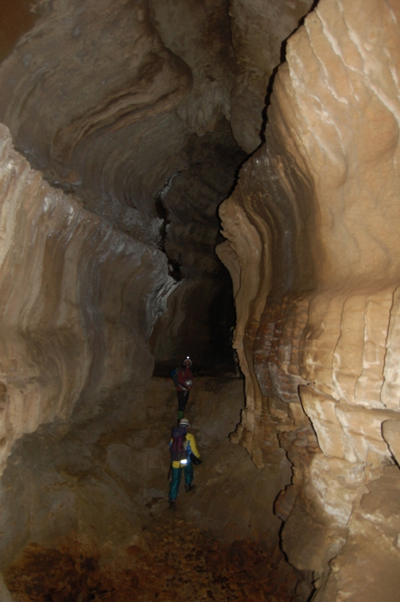
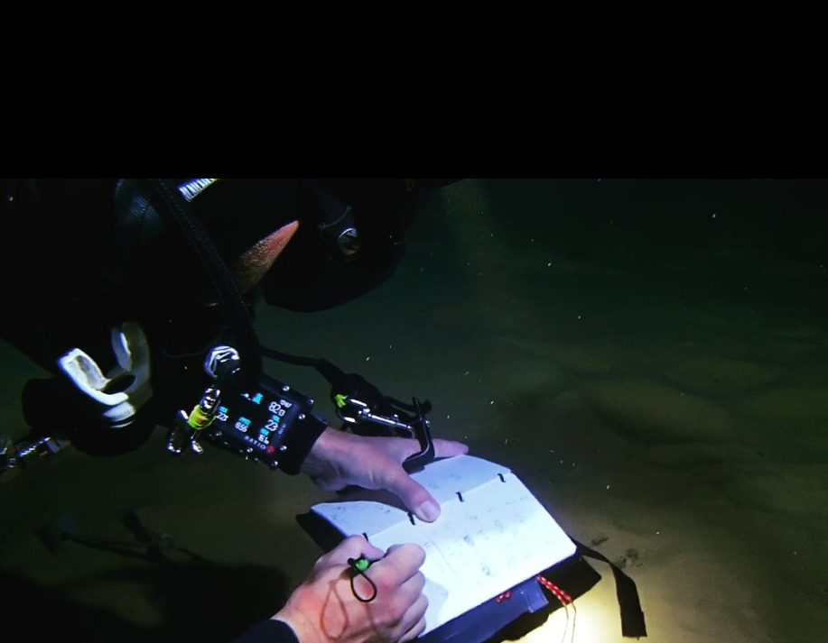

# Historia del buceo

El buceo es una actividad que se ha practicado desde la antigüedad, aunque ha evolucionado mucho a lo largo de los siglos. La primera evidencia de la utilización del buceo se remonta a la época de los egipcios, que utilizaban recipientes de cerámica llenos de aire para sumergirse en el río Nilo y recolectar perlas y piedras preciosas del fondo del río.

En la Edad Media, los buzos utilizaban recipientes de cristal llenos de aire para explorar los fondos marinos y recolectar conchas y piedras preciosas. Estos recipientes eran conocidos como "burbujas" y eran muy peligrosos de usar, ya que el cristal podía romperse fácilmente y el aire se escapaba rápidamente.

Con el tiempo, el buceo comenzó a desarrollarse como una actividad más segura y eficiente. En el siglo XVIII, se inventaron los cascos de buceo, que permitían a los buzos sumergirse más profundamente y por períodos más largos. En el siglo XIX, se inventaron los aparatos de respiración autónomos, que permitían a los buzos sumergirse sin depender de una fuente externa de aire.

Hoy en día, el buceo es una actividad muy popular en todo el mundo y se puede practicar de muchas maneras diferentes, desde el buceo recreativo hasta el buceo técnico y el buceo en cuevas. Aunque ha evolucionado mucho a lo largo de los siglos, el buceo sigue siendo una actividad emocionante y desafiante que permite a las personas explorar los océanos y descubrir la vida marina de una manera única.

# Que es la espeleología

La espeleología es la ciencia que se encarga del estudio de las cuevas y grutas. Se trata de una actividad que combina el senderismo y la exploración con la ciencia y el análisis de los fenómenos geológicos y geomorfológicos que se dan en las cuevas.

Los espeleólogos utilizan una variedad de técnicas y herramientas para explorar y estudiar las cuevas, como el uso de linternas y cascos con luz, el análisis de muestras de roca y la medición de la temperatura y la humedad del aire. También utilizan técnicas de rappel y escalada para acceder a las cuevas y mapear sus interiores.

Las cuevas pueden ser muy peligrosas de explorar, ya que a menudo están oscuras, estrechas y con terreno irregular. Por eso, es importante que los espeleólogos sigan reglas de seguridad estrictas y lleven el equipo adecuado para protegerse a sí mismos y al medio ambiente.

La espeleología es una actividad muy interesante y gratificante, ya que permite a las personas explorar y descubrir lugares únicos y conocer más sobre la geología y la historia de la Tierra. Si te interesa la espeleología, es importante que te informes bien y obtengas la formación y el equipo necesarios para poder hacerlo de manera segura.

# Que es el karst

El karst es un tipo de paisaje geológico que se caracteriza por la presencia de rocas sedimentarias solubles, como el carbonato de calcio, el yeso y el dolomita. Estas rocas se disuelven con el tiempo debido a la acción del agua y el ácido carbónico, lo que conduce a la formación de cuevas, grutas, pozos, simas y otras características topográficas especiales.

El término "karst" se utiliza especialmente para describir estos paisajes en regiones de clima cálido y húmedo, como los trópicos y los subtropicales. Sin embargo, también puede aparecer en otras partes del mundo donde existan rocas sedimentarias solubles y suficiente agua para disolverlas.

El proceso de formación del karst comienza cuando el agua de lluvia se filtra a través de la superficie terrestre y entra en contacto con las rocas sedimentarias solubles. El agua contiene ácido carbónico, que es liberado por la descomposición de materia orgánica en el suelo. Este ácido ataca y disuelve las rocas, lo que conduce a la formación de grietas y poros en la superficie.

Con el tiempo, estos poros y grietas se agrandan y se convierten en cuevas y grutas. Al mismo tiempo, el agua disuelta se filtra hacia abajo y se acumula en acuíferos subterráneos, formando ríos subterráneos y pozos. La acción del agua y el ácido carbónico también puede provocar la formación de simas y otras características topográficas especiales.

El karst es un tipo de paisaje geológico muy importante, ya que puede proporcionar información valiosa sobre la historia geológica de una región y sobre cómo se ha desarrollado a lo largo del tiempo. Además, el karst también es importante desde el punto de vista ecológico, ya que puede alojar una amplia variedad de plantas y animales que se han adaptado a vivir en este entorno único.

# Cual es la historia de la espeleología

La espeleología es una ciencia que se encarga del estudio de las cuevas y grutas y ha sido practicada desde la antigüedad. Los primeros exploradores de cuevas eran cazadores y recolectores que utilizaban las cuevas como refugio y como lugar para almacenar alimentos. También se han encontrado restos de pinturas rupestres en cuevas de todo el mundo, lo que sugiere que las cuevas han sido utilizadas como lugar de culto y comunicación desde tiempos muy antiguos.

En la Edad Media, los monjes y eruditos comenzaron a explorar las cuevas con el fin de estudiar su geología y descubrir su significado simbólico. En el siglo XVIII, la espeleología comenzó a desarrollarse como una ciencia más formalizada y se fundaron las primeras sociedades espeleológicas en Europa.

En el siglo XIX, la espeleología se convirtió en una actividad más popular y se comenzaron a realizar expediciones científicas a cuevas de todo el mundo. En el siglo XX, la espeleología se ha desarrollado aún más y ha sido utilizada como herramienta para estudiar la geología, la historia y la biología de la Tierra.

Hoy en día, la espeleología es una actividad muy popular en todo el mundo y se practica tanto a nivel amateur como profesional. Si te interesa la espeleología, es importante que te informes bien y obtengas la formación y el equipo necesarios para poder hacerlo de manera segura.

# Tipos de cuevas

Las cuevas son formaciones geológicas que se forman en la tierra y en la roca debajo de la superficie terrestre. Se pueden encontrar en muchas partes del mundo y son el resultado de la acción de diferentes procesos geológicos. A continuación se describen algunos de los tipos de cuevas más comunes:

Cuevas de carst: son las cuevas más comunes y se forman cuando el agua contenida ácido carbónico disuelve la roca sedimentaria, como el carbonato de calcio y el dolomita. Esto conduce a la formación de grietas y poros en la superficie de la roca, que con el tiempo se agrandan y se convierten en cuevas. Este proceso es conocido como karstificación.

Cuevas volcánicas: se forman cuando el magma y los gases volcánicos entran en contacto con la roca sólida. El magma se enfría y solidifica, mientras que los gases se escapan por las grietas y poros de la roca, dejando atrás una cueva vacía.

Cuevas glaciares: se forman cuando el hielo se expande y se contrae debido a los cambios de temperatura. Esto provoca que la roca se rompa y se desprenda, formando cuevas.

Cuevas de mina: son cuevas artificiales que se forman cuando se extraen minerales de la tierra. Estas cuevas pueden ser muy grandes y profundas y se utilizan a menudo como almacenes o depósitos.

Cuevas de río: se forman cuando el agua de un río se filtra a través de la roca y erosiona la roca desde adentro. Esto conduce a la formación de cuevas y grutas por debajo del nivel del agua.

En resumen, las cuevas son formaciones geológicas que pueden ser naturales o artificiales y se forman por la acción de diferentes procesos geológicos, como la disolución de la roca, la actividad volcánica, la erosión del hielo y la minería. Cada tipo de cueva tiene sus propias características y puede proporcionar información valiosa sobre la historia geológica y el entorno de una región.

# La topografia

La topografía en cuevas es el estudio de la forma y la estructura de las cuevas y grutas. Se trata de una actividad que combina la exploración y el senderismo con la ciencia y el análisis de los fenómenos geológicos y geomorfológicos que se dan en las cuevas.

Los topógrafos de cuevas utilizan una variedad de técnicas y herramientas para explorar y mapear las cuevas, como el uso de linternas y cascos con luz, el análisis de muestras de roca y la medición de la temperatura y la humedad del aire. También utilizan técnicas de rappel y escalada para acceder a las cuevas y mapear sus interiores.

La topografía en cuevas es una actividad muy interesante y gratificante, ya que permite a las personas explorar y descubrir lugares únicos y conocer más sobre la geología y la historia de la Tierra. Sin embargo, también es una actividad peligrosa y requiere una formación y un equipo adecuados para poder hacerlo de manera segura. Si estás interesado en la topografía en cuevas, es importante que te informes bien y obtengas la formación y el equipo necesarios para poder hacerlo de manera segura.

La topografía de las cuevas se refiere a la forma y la estructura de la cueva y de sus características geológicas. Algunas de las características más comunes que se pueden encontrar en la topografía de las cuevas son:

Entradas: son la parte de la cueva que se encuentra en la superficie terrestre y que permite el acceso a la cueva. Las entradas pueden ser naturales o artificiales y pueden tener diferentes formas y tamaños.

Galerías: son pasajes estrechos y largos que se encuentran dentro de la cueva y que conectan diferentes áreas de la misma. Las galerías pueden tener diferentes formas, como rectas, curvas o zigzags, y pueden estar cubiertas de estalactitas y estalagmitas.

Salas: son espacios grandes y abiertos que se encuentran dentro de la cueva. Las salas suelen tener un techo alto y pueden ser muy anchas y largas.

Chimeneas: son agujeros verticales que atraviesan la cueva desde arriba hasta abajo. Las chimeneas pueden ser naturales o artificiales y se utilizan a menudo como vías de acceso a diferentes niveles de la cueva.

Estalactitas y estalagmitas: son formaciones calcáreas que se forman cuando el agua de lluvia se filtra a través de la roca y deposita calcita en la cueva. Las estalactitas se forman cuando el agua gotea desde el techo de la cueva y las estalagmitas se forman cuando el agua gotea desde el suelo.

En resumen, la topografía de las cuevas es la forma y la estructura de la cueva y de sus características geológicas. Esta topografía puede incluir entradas, galerías, salas, chimeneas y formaciones calcáreas como estalactitas y estalagmitas. Cada cueva es única y su topografía puede proporcionar información valiosa sobre la historia geológica y el entorno de una región.